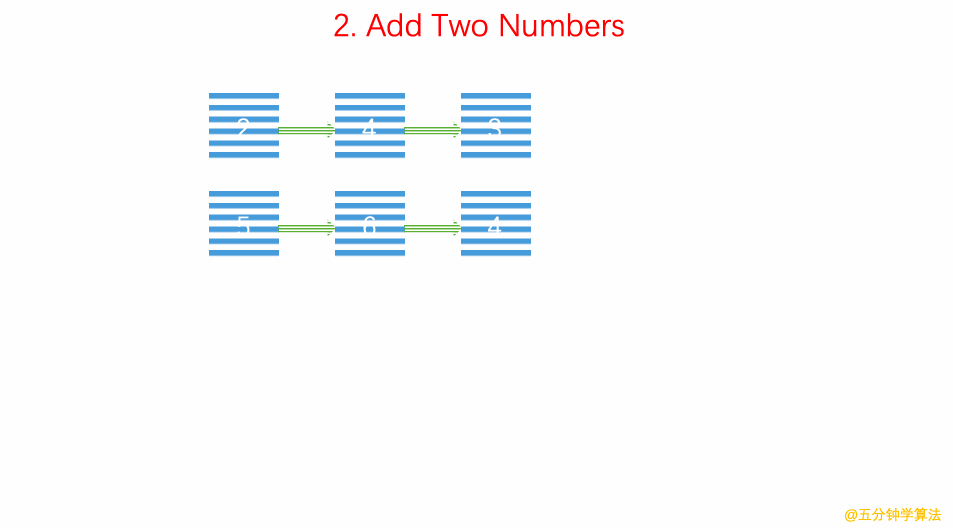

# LeetCode 第 2 号问题：两数相加

> 本文首发于公众号「图解面试算法」，是 [图解 LeetCode ](<https://github.com/MisterBooo/LeetCodeAnimation>) 系列文章之一。
>
> 同步博客：https://www.algomooc.com

题目来源于 LeetCode 上第 2 号问题：两数相加。题目难度为 Medium，目前通过率为 33.9% 。

### 题目描述

给出两个 **非空** 的链表用来表示两个非负的整数。其中，它们各自的位数是按照 **逆序** 的方式存储的，并且它们的每个节点只能存储 **一位** 数字。

如果，我们将这两个数相加起来，则会返回一个新的链表来表示它们的和。

您可以假设除了数字 0 之外，这两个数都不会以 0 开头。

**示例：**

```
输入：(2 -> 4 -> 3) + (5 -> 6 -> 4)
输出：7 -> 0 -> 8
原因：342 + 465 = 807
```

### 题目解析

设立一个表示进位的变量`carried`，建立一个新链表，把输入的两个链表从头往后同时处理，每两个相加，将结果加上`carried`后的值作为一个新节点到新链表后面。

### 动画描述



### 代码实现

#### C++
```c++
/// 时间复杂度: O(n)
/// 空间复杂度: O(n)
/**
 * Definition for singly-linked list.
 * public class ListNode {
 *     int val;
 *     ListNode next;
 *     ListNode(int x) { val = x; }
 * }
 */
class Solution {
public:
    ListNode* addTwoNumbers(ListNode* l1, ListNode* l2) {

        ListNode *p1 = l1, *p2 = l2;
        ListNode *dummyHead = new ListNode(-1);
        ListNode* cur = dummyHead;
        int carried = 0;
        while(p1 || p2 ){
            int a = p1 ? p1->val : 0;
            int b = p2 ? p2->val : 0;
            cur->next = new ListNode((a + b + carried) % 10);
            carried = (a + b + carried) / 10;

            cur = cur->next;
            p1 = p1 ? p1->next : NULL;
            p2 = p2 ? p2->next : NULL;
        }

        cur->next = carried ? new ListNode(1) : NULL;
        ListNode* ret = dummyHead->next;
        delete dummyHead;
        return ret;
    }
};

```
#### Java
```java
class Solution {
    public ListNode addTwoNumbers(ListNode l1, ListNode l2) {
        ListNode dummyHead = new ListNode(0);
        ListNode cur = dummyHead;
        int carry = 0;

        while(l1 != null || l2 != null)
        {
            int sum = carry;
            if(l1 != null)
            {
                sum += l1.val;
                l1 = l1.next;
            }
            if(l2 != null)
            {
                sum += l2.val;
                l2 = l2.next;
            }
            // 创建新节点
            carry = sum / 10;
            cur.next = new ListNode(sum % 10);
            cur = cur.next;
    
        }
        if (carry > 0) {
            cur.next = new ListNode(carry);
        }
        return dummyHead.next;
    }
}
```
#### Python
```python
class Solution(object):
    def addTwoNumbers(self, l1, l2):
        res=ListNode(0)
        head=res
        carry=0
        while l1 or l2 or carry!=0:
            sum=carry
            if l1:
                sum+=l1.val
                l1=l1.next
            if l2:
                sum+=l2.val
                l2=l2.next
            # set value
            if sum<=9:
                res.val=sum
                carry=0
            else:
                res.val=sum%10
                carry=sum//10
            # creat new node
            if l1 or l2 or carry!=0:
                res.next=ListNode(0)
                res=res.next
        return head
```


