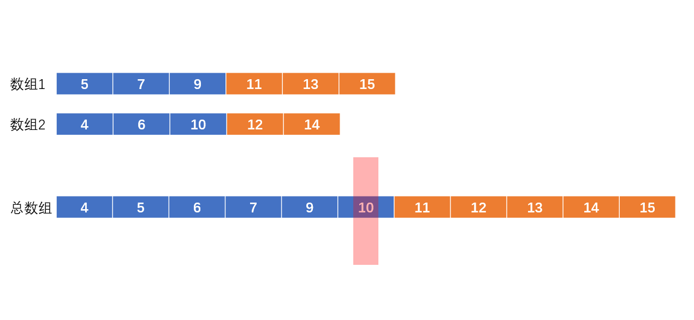
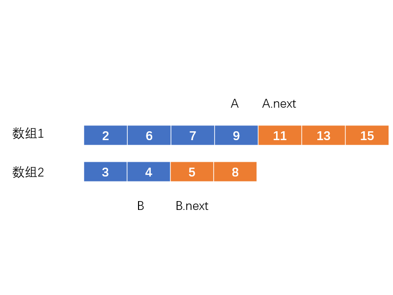
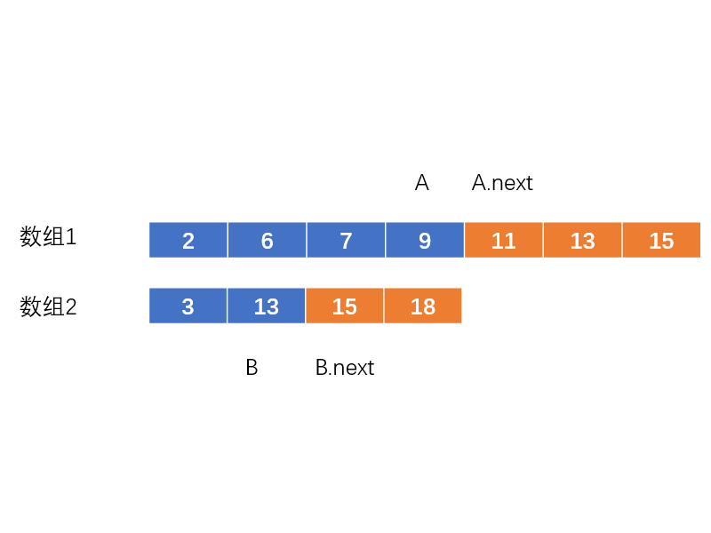
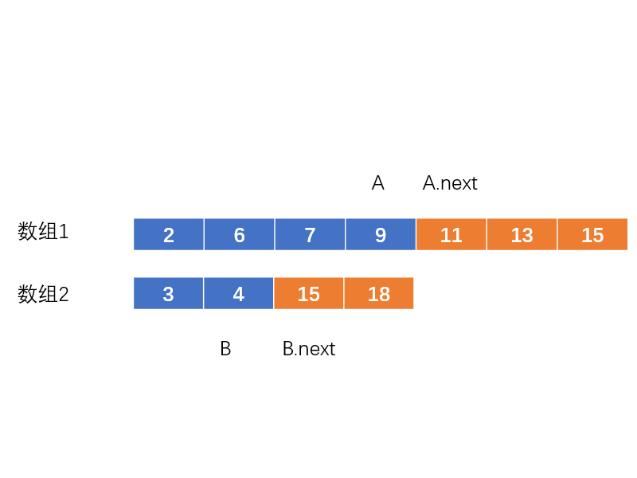
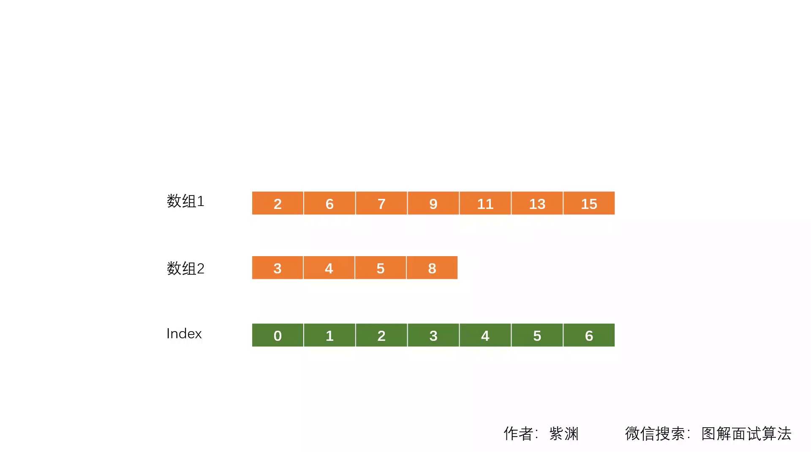

# LeetCode 第 4 号问题：寻找两个正序数组的中位数

> 本文首发于公众号「图解面试算法」，是 [图解 LeetCode ](<https://github.com/MisterBooo/LeetCodeAnimation>) 系列文章之一。
>
> 同步博客：https://www.algomooc.com

题目来源于 LeetCode 上第 4 号问题：寻找两个正序数组的中位数。题目难度为 Hard，目前通过率为 29.0% 。

#### 题目描述

> 给定两个大小为 m 和 n 的正序（从小到大）数组 nums1 和 nums2。
请你找出这两个正序数组的中位数，并且要求算法的时间复杂度为 O(log(m + n))。
你可以假设 nums1 和 nums2 不会同时为空。

```java
示例1：
nums1 = [1, 3]
nums2 = [2]
    
则中位数是 2.0
    
示例2：
nums1 = [1, 2]
nums2 = [3, 4]
    
则中位数是 (2 + 3)/2 = 2.5
```

#### 题目解析
这道题网络上的解析都非常“高深”，很难理解。私以为它们都将简单的问题复杂化了。本题在一些处理上确实会有些麻烦，比如数组边界的处理，和偶数个数的中位数的处理。但其核心思想并不复杂。

首先，我们可以只考虑数字总个数为奇数的情况。让我们看下下图：



蓝框是中位数左边的数（包括中位数），而橘框则为中位数右边的数。

3个显然的规则：
1.两个数组的蓝框总个数=(数字总个数+1)/2;
2.所有蓝框内的数都小于橘框内的数
3.中位数为蓝框中最大的那一位（即数组1蓝框最后一位，或数组2蓝框最后一位）

如图，我们要找到一组A，B，满足上面3条规则。
对于规则1，我们在数组1中找任意A，然后根据规则1就能推算出对应的B的位置。
对于规则2，由于数组1和2都是有序数组，即X1<A<Y1;X2<B<Y2。我们实际上只需要判断A是否小于Y2，以及B是否小于Y2。
对于规则3，由于数组1和2都是有序数组，因此中位数为A,B中较大的那一项。

那么具体该如何操作呢?
由于数组1和2都是有序数组，且题目要求O(log(m+n))复杂度，我们明显应考虑二分法。

**情况1：**



首先，我们选择数组1进行操作。取其中间值9 。（因此 A=9)  根据规则1,我们在数组2中找到对应值（B = 4）。（一共有11个数，(11+1) / 2 = 6，因此蓝色框总数为6）
紧接着，我们根据规则2判断A(9)是否小于B.next(5)，以及B(4)是否小于A.next(11)。
显然，A比B.next,也就是一个橘框还要大。这是不允许的。可见A只能取比9更小的数字了。如果取更大的数字，那B就会更小，更不可能满足规则2。所以这种情况下我们要向左进行二分。

**情况2：**



这种情况下B比A.next,也就是一个橘框还要大。这是不允许的。可见A只能取比9更大的数字了。如果取更小的数字，那B就会更大，更不可能满足规则2。所以这种情况下我们要向右进行二分。

**情况3：**



随着我们不断地二分，中位数显然必然会出现。
如图上这种情况，A小于B.next，且B小于A.next。
那么，显然，A,B中较大的那一项就是中位数（规则3）。

本题算法的核心思想就是这样简单。此外，当数字总数为偶数时，我们需要把我们求得的“中位数"与它下一项相加并除以2即可。由于本题中数字可能相同，所以大小的比较需要使用>=和<=。
下面提供了作者的一份代码，leetcode上的结果为：执行用时：2 ms；内存消耗：40.3 MB，都超过了100%的用户。读者可以参考一下。


#### 代码实现

Java语言

```java
public class Solution {
  public double findMedianSortedArrays(int[] nums1, int[] nums2) {
    // 使nums1成为较短数组,不仅可以提高检索速度,同时可以避免一些边界问题
    if (nums1.length > nums2.length) {
      int[] temp = nums1;
      nums1 = nums2;
      nums2 = temp;
    }

    int len1 = nums1.length;
    int len2 = nums2.length;
    int leftLen = (len1 + len2 + 1) / 2; //两数组合并&排序后,左半边的长度
    
    // 对数组1进行二分检索
    int start = 0;
    int end = len1;
    while (start <= end) {
      // 两个数组的被测数A,B的位置(从1开始计算)
      // count1 = 2 表示 num1 数组的第2个数字
      // 比index大1
      int count1 = start + ((end - start) / 2);
      int count2 = leftLen - count1;
      
      if (count1 > 0 && nums1[count1 - 1] > nums2[count2]) {
        // A比B的next还要大
        end = count1 - 1;
      } else if (count1 < len1 && nums2[count2 - 1] > nums1[count1]) {
        // B比A的next还要大
        start = count1 + 1;
      } else {
        // 获取中位数
        int result =  (count1 == 0)? nums2[count2 - 1]: // 当num1数组的数都在总数组右边
                      (count2 == 0)? nums1[count1 - 1]: // 当num2数组的数都在总数组右边
                      Math.max(nums1[count1 - 1], nums2[count2 - 1]); // 比较A,B
        if (isOdd(len1 + len2)) {
          return result;
        }

        // 处理偶数个数的情况
        int nextValue = (count1 == len1) ? nums2[count2]:
                        (count2 == len2) ? nums1[count1]:
                        Math.min(nums1[count1], nums2[count2]);
        return (result + nextValue) / 2.0;
      }
    }

    return Integer.MIN_VALUE; // 绝对到不了这里
  }

  // 奇数返回true,偶数返回false
  private boolean isOdd(int x) {
    return (x & 1) == 1;
  }
}
```

#### 动画理解



#### 复杂度分析

+ 时间复杂度：对数组进行二分查找，因此为O(logN)
+ 空间复杂度：O(1)


