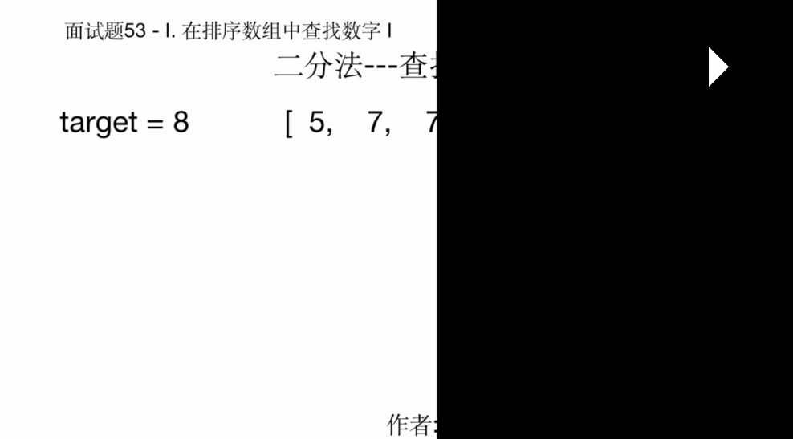

# 面试题53 - I. 在排序数组中查找数字 I

> 本文首发于公众号「图解面试算法」，是 [图解 LeetCode ](<https://github.com/MisterBooo/LeetCodeAnimation>) 系列文章之一。
>
> 同步博客：https://www.algomooc.com

题目来源于 LeetCode 上 面试题53 - I. 在排序数组中查找数字 I. 是算法入门的一道题。

## 题目

统计一个数字在排序数组中出现的次数。


示例 1:

```
输入: nums = [5,7,7,8,8,10], target = 8
输出: 2
```

示例 2:


```
输入: nums = [5,7,7,8,8,10], target = 6
输出: 0
```


限制：

```
0 <= 数组长度 <= 50000
```


## 思路解析

### 暴力循环法

题目看上去是很简单，就是找到一个目标数字在数组中出现的次数，不管数组是有序还是无序的，我们都可以用的一种方法就是暴力循环法

#### 思路

定义一个count来记录目标值出现的次数，初始值为0，然后遍历这个数组，然后如果当前值和目标值target一致，那么count就加一，最后return count。这种解法的时间复杂度是O(N)

#### 代码实现


```javaScript
/**
 * @param {number[]} nums
 * @param {number} target
 * @return {number}
 */
var search = function(nums, target) {
    let count = 0;
    for(let i of nums) {
    	if (i === target) {
    		count++
    	}
    }
    return count
};
```

### 改良的暴力循环

#### 思路

因为数组已排序了，所以我们其实可以不用遍历全部，用双指针分别从头部和尾部开始同时遍历，然后找到目标值的左右边界的位置，然后通过计算得到count。其实就是比全部遍历少了目标值出现的次数，它的算法复杂度还是O(n)

	count = 右边界的index - 左边界的index + 1

#### 代码实现


```javaScript
/**
 * @param {number[]} nums
 * @param {number} target
 * @return {number}
 */
var search = function(nums, target) {
    let [left,  right] = [0, nums.length - 1]
    while(left <= right && (nums[left] !== target || nums[right] !== target)) {
    	if (left === right && nums[left] !== target) {
    		return 0;
    	}else if (nums[left] !== target) {
    		left++;
    	}else if (nums[right] !== target){
    		right--;
    	}
    }
    return right - left + 1;
};
```

### 二分法

#### 思路

除了遍历，我们在排序数组中查找值还可以用的一种方法是二分法，思路还是和改良的暴力循环法一样，先找到左右边界，然后做计算。时间复杂度为O(logn)

#### 代码实现

```javaScript
/**
 * @param {number[]} nums
 * @param {number} target
 * @return {number}
 */
var search = function(nums, target) {
    let start = 0;
    let mid = 0;
    let end =  nums.length - 1;
    let left = 0;
    let right = 0;
  	// 查找右边界
    while(start <= end) {
        mid = Math.ceil((start + end) / 2)
        if (nums[mid] <= target) {
            start = mid + 1
        } else {
            end = mid -1
        }
    }
    right = start - 1; // 右边界
  	// 查找左边界
    start = 0;
    mid = 0; 
    end =  nums.length - 1;
    while(start <= end) {
        mid = Math.ceil((start + end) / 2)
        if (nums[mid] < target) {
            start = mid + 1
        } else {
            end = mid -1
        }
    }
    left = end + 1
    return right - left + 1
};
```

## 动画理解




  