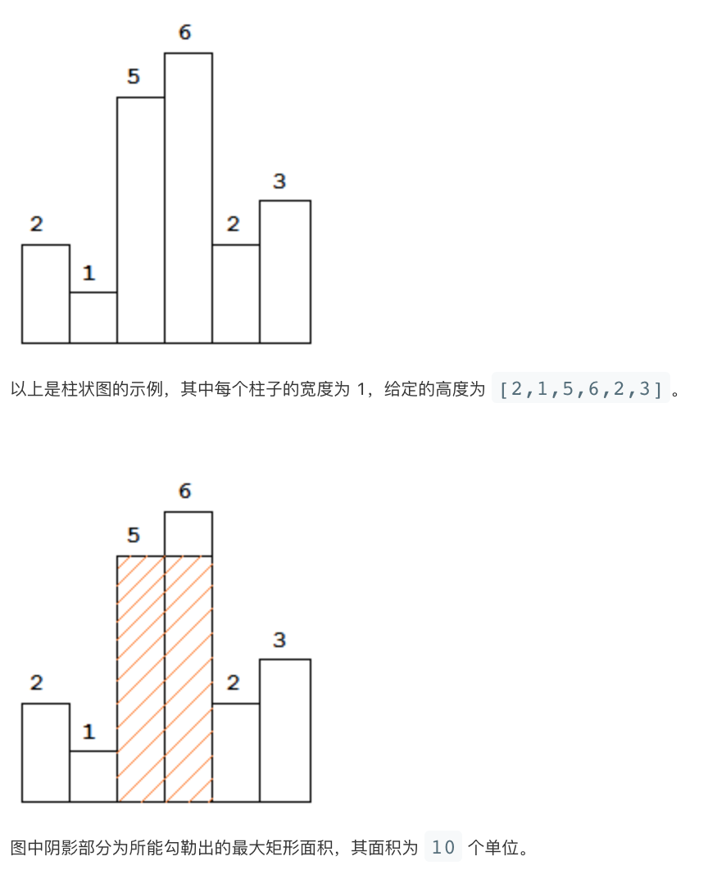

# LeetCode 第 84 号问题：柱状图中的最大矩形

> 本文首发于公众号「图解面试算法」，是 [图解 LeetCode](<https://github.com/MisterBooo/LeetCodeAnimation>) 系列文章之一。
>
> 同步博客：https://www.algomooc.com

题目来源于 LeetCode 上第 84 号问题：柱状图中的最大矩形。题目难度为 Hard，目前通过率为 39.2% 。


<br>


### 题目描述

给定 n 个非负整数，用来表示柱状图中各个柱子的高度。每个柱子彼此相邻，且宽度为 1 。

求在该柱状图中，能够勾勒出来的矩形的最大面积。

**示例 1:**




<br>

### 题目解析

给一个条形图，让你找出这里面面积最大的矩形，条形图中每一个位置的高度不固定，但是宽度都是 1。因为矩形的方向，大小都不确定，直观去看的话思路并不明显，但是有一点很明确，一段区间形成的矩形总是和最短的高度有关，我们还是来看看题目给的例子:

```
[2,1,5,6,2,3]

我们假定矩形可以由一个区间 [start, end] 确定，
那么这个区间的矩形的高度其实是由这个区间的最小值决定

[0,1] 区间内的矩形的高度是 1，面积 1 * 2 = 2
[2,3] 区间内的矩形的高度是 5，面积 5 * 2 = 10
[0,5] 区间内的矩形的高度是 1，面积 1 * 6 = 6
[2,5] 区间内的矩形的高度是 2，面积 2 * 4 = 8
...
```

如果你明白了上面的例子，这道题目思路就有了，也就是 “**找出数组的所有区间(子数组)，区间中 最小元素的值 * 区间的长度 就是当前区间表示的矩形的面积，在所有区间中找最大面积的矩形即可**”。这个思路非常的直接，这么样下来，找出数组的所有子数组，这个时间复杂度是 O(n^2)，有没有办法优化呢？

上面的解法，你直观上看就是一个暴力的解法，因为我们不断地去找子数组，这里面其实有很多的重复计算，比如，还是刚刚那个例子：
```
[2,1,5,6,2,3]

[2,1,5,6,2] 我们遍历了一遍，得到矩阵的高度的最小值，然后求出面积
[1,2,6,2] 我们又接着重新遍历一遍，得到矩阵的高度的最小值，然后求出面积

求第二个区间的时候，我们完全没有借鉴第一个区间的答案，存在着重复计算
```

这个时候，我们可能需要换一个思路来看待这个问题，从上面的分析，我们已经得知，矩阵的高都来自于数组中元素的值，可以思考 “**如果以当前位置的元素作为矩形的高，最多向左向右分别延伸多少个位置**”，比如：

```
[2,1,5,6,2,3]

如果我们取数组中第 2 个元素，也就是 1，作为矩阵的高
它向左可以延伸到 2，向右可以延伸到 3，于是面积就是 1 * 6 = 6

如果我们取数组中第 5 个元素，也就是 2，作为矩阵的高
它向左可以延伸到 5，向右可以延伸到 3，于是面积就是 2 * 4 = 8

如果我们取数组中第 3 个元素，也就是 5，作为矩阵的高
它向左可以延伸到 5（它自己），向右可以延伸到 6，于是面积就是 5 * 2 = 10

...
```

好了，思路分析完了，现在如何实现这么一个思想呢？我们需要确定一个元素可以延伸到的左边界和右边界，这么说你可能不太好理解，换种说法，其实我们需要找 “**左边第一个比当前元素小的元素所在的位置，右边第一个比当前元素小的元素所在位置**”，还是来看看例子：

```
[2,1,5,6,2,3]

数组第 2 个元素 1，左右均没有比它小的元素，因此它所确定的区间就是整个数组

数组第 5 个元素 2，左边第一个比它小的元素是 1，右边第一个比它小的元素是 -1（表示没有）
因此它所确定的区间就是 [2, 5]

数组第 3 个元素 5，左边第一个比它小的元素是 1，右边第一个比它小的元素是 6
因此它所确定的区间就是 [2, 3]

...
```

在实现上面我们需要利用栈这个数据结构，栈里面存放的元素对应的值都是**单调递增**的，这样可以保证从左向右遍历数组，前一个入栈的元素是后一个入栈的元素的左边界，另外，如果下一个准备入栈的元素比栈顶元素的值小，说明栈顶元素的右边界也找到了，左右边界都找到了，栈顶元素出栈进行计算。这样下来，一个元素只会进栈一次，出栈一次，因此时间复杂度是 O(2 * n) 也就是 O(n)

**单调栈**这个数据结构应用还是比较广泛的，如果发现题目中需要针对数组中一个元素向左右两边延伸去确定区间，而且延伸的条件跟元素的值有关，那么就可以考虑使用单调栈。

<br>

### 代码实现（暴力解法）

```java
public int largestRectangleArea(int[] heights) {
    if (heights == null || heights.length == 0) {
        return 0;
    }
    
    int n = heights.length;
    int result = 0;
    
    for (int i = 0; i < n; ++i) {
        int curMin = heights[i];
        
        for (int j = i; j < n; ++j) {
            curMin = Math.min(curMin, heights[j]);
            result = Math.max(result, (j - i + 1) * curMin);
        }
    }
    
    return result;
}
```

<br>

### 代码实现（单调栈）

```java
public int largestRectangleArea(int[] heights) {
    if (heights == null || heights.length == 0) {
        return 0;
    }

    int n = heights.length;
    
    Stack<Integer> stack = new Stack<>();
    
    int result = 0;
    
    for (int i = 0; i <= n; ++i) {
        // curElement 表示当前元素的值，用 -1 表示数组的结束
        int curElement = (i == n) ? -1 : heights[i];
        
        // 元素的出栈操作，表明当前栈顶元素找到了右边界
        // 加上栈内存放的元素是单调递增的，因此左边界也找到了
        // while 里面针对栈顶元素这个高度的矩形计算面积即可
        while (!stack.isEmpty() && heights[stack.peek()] >= curElement) {
            int high = heights[stack.pop()];
            int width = stack.isEmpty() ? i : i - stack.peek() - 1;
            
            result = Math.max(result, high * width);
        }
        
        stack.push(i);
    }
    
    return result;
}
```

<br>

### 动画描述


<br>

### 复杂度分析

暴力解法的时间复杂度是 `O(n^2)`，这个从上面的描述中不难看出。在单调栈的代码实现中，你可能会觉得这里有两个嵌套循环，因此时间复杂度是 `O(n^2)`，但其实不是这样，考虑时间复杂度仅仅看代码的形式是不够的，你可以这样考虑，因为数组中的每个元素仅入栈一次，出栈一次，因此正确的时间复杂度是 `O(2n)`，忽略常数项，也就是 `O(n)`，单调栈的解法中用到了栈，因此空间复杂度是 `O(n)`。

<br>

