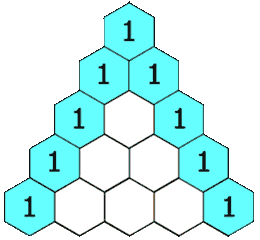

## LeetCode第118号问题：杨辉三角

> 本文首发于公众号「图解面试算法」，是 [图解 LeetCode ](<https://github.com/MisterBooo/LeetCodeAnimation>) 系列文章之一。
>
> 个人博客：www.zhangxiaoshuai.fun

**本题选自leetcode第118题，easy级别，目前通过率66.4%**
### 题目描述：
```
给定一个非负整数 numRows，生成杨辉三角的前 numRows 行。
示例:

输入: 5
输出:
[
    	 [1],
   	 	[1,1],
  	   [1,2,1],
  	  [1,3,3,1],
 	 [1,4,6,4,1]
]
```

### 题目分析：
初中时候学习的杨辉三角想不到又在这里出现了，题意很容易理解，每一行中的第一个数字和最后一个数字都是1，中间的数字都是通过上面相邻的两个数字相加得到。题目给我们一个杨辉三角的非负行数，然后我们生成对应的杨辉三角（集合）。
既然返回的是一个List<List<Integer>>，那么我们用一个大集合来放置每一行的数，每一行的数我们分别用一个小集合来存放，最后将每一个小集合添加进大集合中。

### gif动画演示：

官方中已经有做的非常好的gif图解，这里直接展示：



### 代码：

```java
public List<List<Integer>> generate(int numRows) {
    List<List<Integer>> triangle = new ArrayList<List<Integer>>();
    //给定的numRows为0时直接返回空集合即可
    if (numRows == 0) {
        return triangle;
    }

    //因为杨辉三角的第一行总是1，所以先新建一个list，并将1加入该list中
    triangle.add(new ArrayList<>());
    triangle.get(0).add(1);

    //从第二行开始，新建表示当前行的list，拿到当前行的前一行的list
    for (int rowNum = 1; rowNum < numRows; rowNum++) {
        List<Integer> row = new ArrayList<>();
        List<Integer> prevRow = triangle.get(rowNum-1);

        //一行中的第一个元素
        row.add(1);

        //针对每一行，都是上一行的相邻的两个元素相加得到两个1中间的数
        for (int j = 1; j < rowNum; j++) {
            row.add(prevRow.get(j-1) + prevRow.get(j));
        }

        //一行中的最后一个元素
        row.add(1);

        //最后将“整行添加到大集合中”
        triangle.add(row);
    }
	return triangle;
}
```


