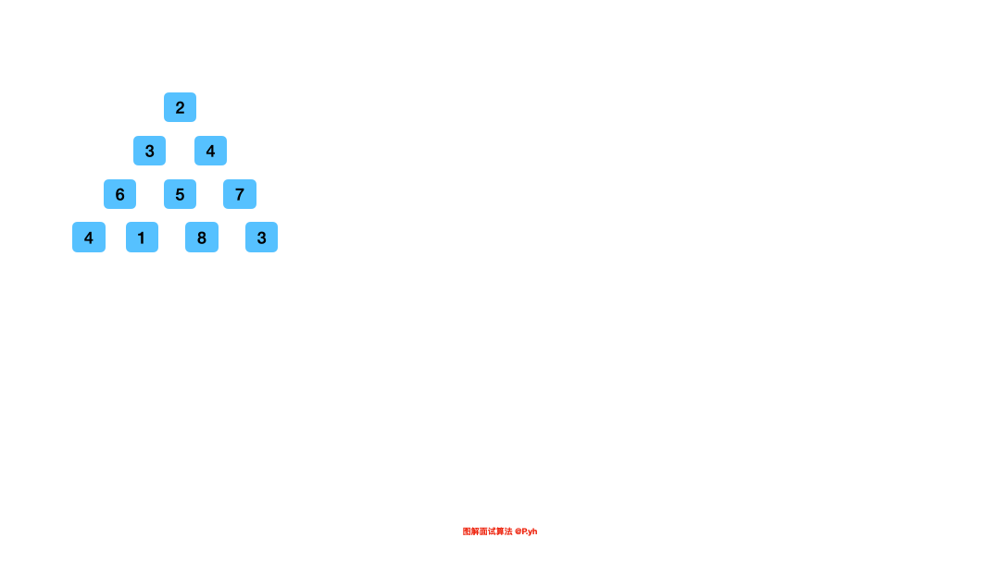

# LeetCode 第 120 号问题：三角形最小路径和

> 本文首发于公众号「图解面试算法」，是 [图解 LeetCode](<https://github.com/MisterBooo/LeetCodeAnimation>) 系列文章之一。
>
> 同步博客：https://www.algomooc.com

题目来源于 LeetCode 上第 120 号问题：三角形最小路径和。题目难度为 Medium，目前通过率为 64.7% 。


<br>


### 题目描述

给定一个三角形，找出自顶向下的最小路径和。每一步只能移动到下一行中相邻的结点上。

相邻的结点 在这里指的是 下标 与 上一层结点下标 相同或者等于 上一层结点下标 + 1 的两个结点。


**示例 1:**

```
[
     [2],
    [3,4],
   [6,5,7],
  [4,1,8,3]
]
```
自顶向下的最小路径和为 11（即，2 + 3 + 5 + 1 = 11）。

**说明：**

如果你可以只使用 O(n) 的额外空间（n 为三角形的总行数）来解决这个问题，那么你的算法会很加分。

<br>

### 题目解析

给定一个三角形数组，需要求出从上到下的最小路径和，再确定这道题目可以用动态规划来解后，可以按照四个步骤来分析：

* 问题拆解：
  
  这里的总问题是求出最小的路径和，路径是这里的分析重点，路径是由一个个元素组成的，`[i][j]` 位置的元素，经过这个元素的路径肯定也会经过 `[i - 1][j]` 或者 `[i - 1][j - 1]`，因此经过一个元素的路径和可以通过这个元素上面的一个或者两个元素的路径和得到
  
* 状态定义
  
  状态的定义一般会和问题需要求解的答案联系在一起，这里其实有两种方式，一种是考虑路径从上到下，另外一种是考虑路径从下到上，因为元素的值是不变的，所以路径的方向不同也不会影响最后求得的路径和，如果是从上到下，你会发现，在考虑下面元素的时候，起始元素的路径只会从 [i - 1][j] 获得，每行当中的最后一个元素的路径只会从 [i - 1][j - 1] 获得，中间二者都可，这样不太好实现，因此这里考虑从下到上的方式，状态的定义就变成了 “**最后一行元素到当前元素的最小路径和**”，对于 [0][0] 这个元素来说，最后状态表示的就是我们的最终答案

* 递推方程

  “状态定义” 中我们已经定义好了状态，递推方程就出来了 
  ```
  dp[i][j] = Math.min(dp[i + 1][j], dp[i + 1][j + 1]) + triangle[i][j]
  ```
  
* 实现
  
  这里初始化时，我们需要将最后一行的元素填入状态数组中，然后就是按照前面分析的策略，从下到上计算即可

这里有一个小小的空间上面的优化，就是每次我们更新状态(dp)数组都是基于之前的结果，我们并不需要知道之前的之前的结果，平行的状态之间也没有相互影响，因此只用开一维数组即可

<br>

### 代码实现（空间优化前）

```java
public int minimumTotal(List<List<Integer>> triangle) {
    int n = triangle.size();
    
    int[][] dp = new int[n][n];
    
    List<Integer> lastRow = triangle.get(n - 1);
    
    for (int i = 0; i < n; ++i) {
        dp[n - 1][i] = lastRow.get(i);
    }
    
    for (int i = n - 2; i >= 0; --i) {
        List<Integer> row = triangle.get(i);
        for (int j = 0; j < i + 1; ++j) {
            dp[i][j] = Math.min(dp[i + 1][j], dp[i + 1][j + 1]) + row.get(j);
        }
    }
    
    return dp[0][0];
}
```

<br>

### 代码实现（空间优化后）
```java
public int minimumTotal(List<List<Integer>> triangle) {
    int n = triangle.size();
    
    int[] dp = new int[n];

    List<Integer> lastRow = triangle.get(n - 1);

    for (int i = 0; i < n; ++i) {
        dp[i] = lastRow.get(i);
    }

    for (int i = n - 2; i >= 0; --i) {
        List<Integer> row = triangle.get(i);
        for (int j = 0; j < i + 1; ++j) {       // i + 1 == row.size()
            dp[j] = Math.min(dp[j], dp[j + 1]) + row.get(j);
        }
    }

    return dp[0];
}
```

<br>

### 动画描述



<br>

### 复杂度分析

时空复杂度从代码中都清晰可见，我们必须遍历三角形中的每个元素。时间复杂度就是 `O(1 + 2 + ... + n)`，也就是 `O(n^2)`。空间复杂度经过优化后是 `O(n)`。

