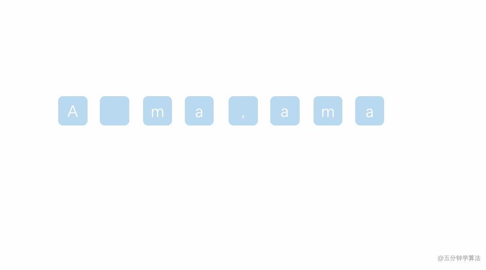

# LeetCode 第 125 号问题：验证回文串

> 本文首发于公众号「图解面试算法」，是 [图解 LeetCode ](<https://github.com/MisterBooo/LeetCodeAnimation>) 系列文章之一。
>
> 同步博客：https://www.algomooc.com

题目来源于 LeetCode 第 125 号问题：验证回文串。这道题目是 **初级程序员** 在面试的时候经常遇到的一道算法题，而且面试官喜欢面试者手写！


### 题目描述

给定一个字符串，验证它是否是回文串，只考虑字母和数字字符，可以忽略字母的大小写。

**说明：**本题中，我们将空字符串定义为有效的回文串。

**示例 1:**

```
输入: "A man, a plan, a canal: Panama"
输出: true
```

**示例 2:**

```
输入: "race a car"
输出: false
```

### 题目解析

先理解一个概念：所谓回文，就是一个正读和反读都一样的字符串。

先假设是验证单词 `level` 是否是回文字符串，通过概念涉及到 正 与 反 ，那么很容易想到使用双指针，从字符的开头和结尾处开始遍历整个字符串，相同则继续向前寻找，不同则直接返回 false。

而这里与单独验证一个单词是否是回文字符串有所区别的是加入了 空格 与 非字母数字的字符，但实际上的做法一样的：

一开始先建立两个指针，left 和 right , 让它们分别从字符的开头和结尾处开始遍历整个字符串。

如果遇到非字母数字的字符就跳过，继续往下找，直到找到下一个字母数字或者结束遍历，如果遇到大写字母，就将其转为小写。

当左右指针都找到字母数字时，可以进行比较的时候，比较这两个字符，如果相等，则两个指针向它们的前进方向挪动，然后继续比较下面两个分别找到的字母数字，若不相等，直接返回 false。

### 动画描述



### 代码实现

注：`isLetterOrDigit ` 方法确定指定的字符是否为字母或数字。

```java
class Solution {
    public boolean isPalindrome(String s) {
        if(s.length() == 0)
             return true;
        int l = 0, r = s.length() - 1;
        while(l < r){
            //确定指定的字符是否为字母或数字
            if(!Character.isLetterOrDigit(s.charAt(l))){
                l++;
            }else if(!Character.isLetterOrDigit(s.charAt(r))){
                r--;
            }else{
                if(Character.toLowerCase(s.charAt(l)) != Character.toLowerCase(s.charAt(r)))
                    return false;
                l++;
                r--;
            } 
        }
        return true;
    }
}

```

