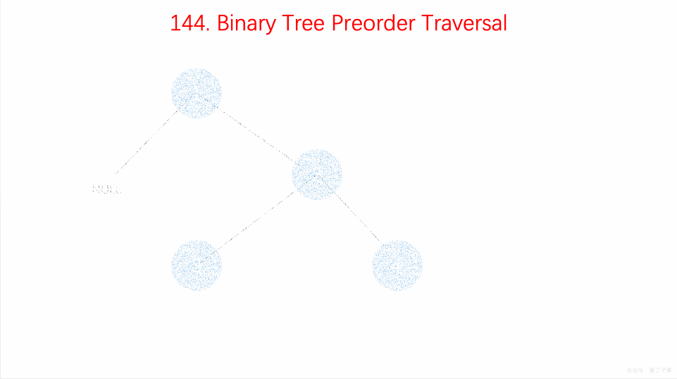

# LeetCode 第 144 号问题：二叉树的前序遍历

> 本文首发于公众号「图解面试算法」，是 [图解 LeetCode ](<https://github.com/MisterBooo/LeetCodeAnimation>) 系列文章之一。
>
> 同步博客：https://www.algomooc.com

题目来源于 LeetCode 上第 144 号问题：二叉树的前序遍历。题目难度为 Medium，目前通过率为 59.8% 。

### 题目描述

给定一个二叉树，返回它的 *前序* 遍历。

 **示例:**

```
输入: [1,null,2,3]  
   1
    \
     2
    /
   3 

输出: [1,2,3]
```

**进阶:** 递归算法很简单，你可以通过迭代算法完成吗？

### 题目解析

用**栈(Stack)**的思路来处理问题。

前序遍历的顺序为**根-左-右**，具体算法为：

- 把根节点 push 到栈中
- 循环检测栈是否为空，若不空，则取出栈顶元素，保存其值
- 看其右子节点是否存在，若存在则 push 到栈中
- 看其左子节点，若存在，则 push 到栈中。


### 动画描述



### 代码实现

```
class Solution {
    public List<Integer> preorderTraversal(TreeNode root) {
        //非递归前序遍历，需要借助栈
        Stack<TreeNode> stack = new Stack<>();
        List<Integer> list = new LinkedList<>();
        //当树为空树时，直接返回一个空list
        if(root == null){
            return list;
        }
        //第一步是将根节点压入栈中
        stack.push(root);
        //当栈不为空时，出栈的元素插入list尾部。
        //当它的孩子不为空时，将孩子压入栈，一定是先压右孩子再压左孩子
        while(!stack.isEmpty()){
            //此处的root只是一个变量的复用
            root = stack.pop();
            list.add(root.val);
            if(root.right != null) stack.push(root.right);
            if(root.left != null) stack.push(root.left);
        }
        return list;
    }
}
```


