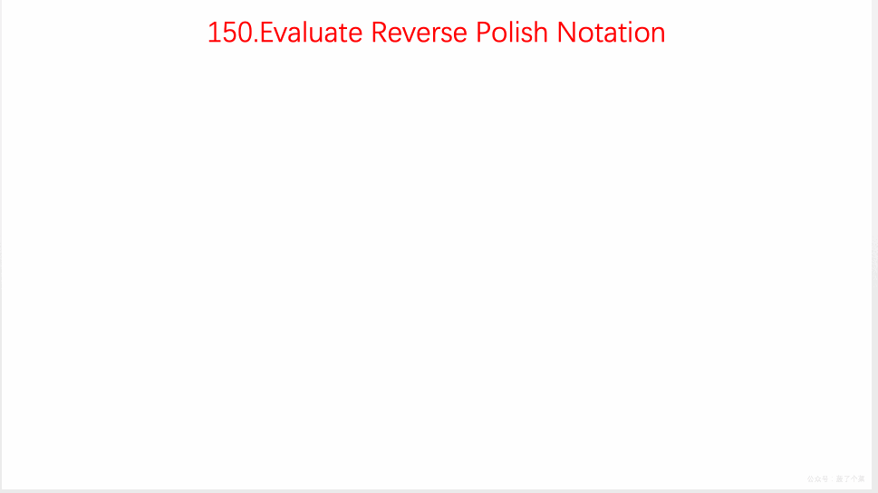

# LeetCode 第 150 号问题：逆波兰表达式求值

> 本文首发于公众号「图解面试算法」，是 [图解 LeetCode ](<https://github.com/MisterBooo/LeetCodeAnimation>) 系列文章之一。
>
> 同步博客：https://www.algomooc.com

题目来源于 LeetCode 上第 150 号问题：逆波兰表达式求值。题目难度为 Medium，目前通过率为 43.7% 。

### 题目描述

根据[逆波兰表示法](https://baike.baidu.com/item/%E9%80%86%E6%B3%A2%E5%85%B0%E5%BC%8F/128437)，求表达式的值。

有效的运算符包括 `+`, `-`, `*`, `/` 。每个运算对象可以是整数，也可以是另一个逆波兰表达式。

**说明：**

- 整数除法只保留整数部分。
- 给定逆波兰表达式总是有效的。换句话说，表达式总会得出有效数值且不存在除数为 0 的情况。

**示例 1：**

```
输入: ["2", "1", "+", "3", "*"]
输出: 9
解释: ((2 + 1) * 3) = 9
```

**示例 2：**

```
输入: ["4", "13", "5", "/", "+"]
输出: 6
解释: (4 + (13 / 5)) = 6
```

**示例 3：**

```
输入: ["10", "6", "9", "3", "+", "-11", "*", "/", "*", "17", "+", "5", "+"]
输出: 22
解释: 
  ((10 * (6 / ((9 + 3) * -11))) + 17) + 5
= ((10 * (6 / (12 * -11))) + 17) + 5
= ((10 * (6 / -132)) + 17) + 5
= ((10 * 0) + 17) + 5
= (0 + 17) + 5
= 17 + 5
= 22
```

### 题目解析

用数据结构`栈`来解决这个问题。

- 从前往后遍历数组
- 遇到数字则压入栈中
- 遇到符号，则把栈顶的两个数字拿出来运算，把结果再压入栈中
- 遍历完整个数组，栈顶数字即为最终答案

### 动画描述



### 代码实现

```
class Solution {
public:
    int evalRPN(vector<string>& tokens) {

        stack<int> nums;
        stack<char> ops;
        for(const string& s: tokens){
            if(s == "+" || s == "-" || s == "*" || s == "/"){
                int a = nums.top();
                nums.pop();
                int b = nums.top();
                nums.pop();

                if(s == "+"){
                    nums.push(b + a);
                }else if(s == "-"){
                    nums.push(b - a);
                } else if(s == "*"){
                    nums.push(b * a);
                }else if(s == "/"){
                    nums.push(b / a);
                }
            }
            else{
                nums.push(atoi(s.c_str()));
            }
        }
        return nums.top();
    }
};
```


