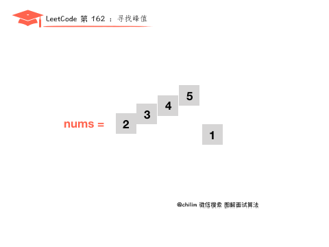

题目来源于LeetCode上第162号问题：寻找峰值。题目难度为中等，目前通过率46.3%。
##题目描述
峰值元素是指其值大于左右相邻值的元素。
给定一个输入数组``` nums```，其中 ```nums[i] ≠ nums[i+1]```，找到峰值元素并返回其索引。
数组可能包含多个峰值，在这种情况下，返回任何一个峰值所在位置即可。
你可以假设 ```nums[-1] = nums[n] = -∞```。

```
示例 1:

输入:nums = [1,2,3,1]
输出: 2
解释: 3 是峰值元素，你的函数应该返回其索引 2。
示例 2:

输入: nums = [1,2,1,3,5,6,4]
输出: 1 或 5 
解释: 你的函数可以返回索引 1，其峰值元素为 2；或者返回索引 5， 其峰值元素为 6。
说明:
你的解法应该是 O(logN) 时间复杂度的。
```
##题目解析
我们从题目中可以了解到以下三个关键信息：
- ```nums[i] ≠ nums[i+1]```，意味着数组中没有值相等的元素，要么```nums[i]>nums[i+1]```，要么```nums[i]<nums[i+1]```
- 数组可能有多个峰值，我们只需要返回任意一个峰值的索引就行了。
- 假设```nums[-1] = nums[n] = -∞```，因为数组两端都是负无穷，这意味着从```nums[0]```开始，一直找到有个值```nums[i]>nums[i+1]```，那么数组肯定有一个峰值，我们将他的索引返回就行了。

为了更好的理解解题思路，我们先从线性搜索方法开始解析，并且将数组分为三类，即升序数组，降序数组，无序数组。然后，由于我们只需要找到任意一个峰值，返回它的索引就行。所以我们还可以用二分查找法（**PS：凡是搜索查找类型的题，首先想到的应该是效率较高的二分查找方法**）
## 解法一：线性扫描

**1、假设数组是升序数组**

那么很明显我们的峰值是最后一个元素5，因为```nums[0]>nums[1]，nums[1]>nums[2]， ......，nums[3]>nums[4]```，```nums[4]```是最后一个元素，所以它的峰值索引是4。
**2、假设数组是降序数组**

因为```nums[-1]=-∞```，并且```nums[0]>mums[1]```，所以```nums[0]```就是一个峰值，返回峰值索引是0。
**3、假设数组是无序数组**

同样我们从```nums[0]```开始往后比较大小，因为```nums[0]<nums[1],mums[1]<nums[2],mums[2]<nums[3],mums[3]>mums[4]```，所以可以知道```mums[3]```是一个峰值，返回索引是3。

通过以上将数组分类解析，我们可以发现只要从```nums[0]```开始，与后一个元素比较，直到找到 ```nums[i]>nums[i+1]```，为止，我们就找到了一个峰值，这个峰值的索引就是```i```，如果一直都没有找到```nums[i]>nums[i+1]```的情况，那么峰值就是数组的最后一个元素，索引就是```nums.length-1```。

##动画理解


##代码实现
```
public class Solution {
    public int findPeakElement(int[] nums) {
        for (int i = 0; i < nums.length - 1; i++) {
            if (nums[i] > nums[i + 1])
                return i;
        }
        return nums.length - 1;
    }
}
```
##复杂度分析

- 时间复杂度：O(n)，我们对长度为 n 的数组 nums 只进行一次遍历。
- 空间复杂度：O(1)，仅用了常数空间

##解法二：二分查找

根据二分查找原理，我们假设左边索引```L=0```，右边索引```R=nums.length - 1```，中间索引```M=（L+R）/2```，现在主要就是判断这个峰值是在```M```的左边还是右边，然后移动```L```或者```R```来进一步缩小搜索范围。

我们找到中间元素，然后跟方法一线性扫描一样，与中间元素的右边元素比较。
- 如果```nums[M]<nums[M+1]```那么可以知道中间元素```M```的右边肯定会有一个峰值，所以我们把```L```移到```M+1```的位置，在```M```的右边查找。并且重新计算```M```的值。
- 如果```nums[M]>nums[M+1]```那么可以知道中间元素```M```的左边肯定会有一个峰值，所以我们把```R```移到```M```的位置，在```M```的左边查找，并且重新计算```M```的值。
- 重复以上步骤，直到```R=L```，那么这个就是峰值元素。

##动画理解



##代码实现

```
public class Solution {
    public int findPeakElement(int[] nums) {
        int l = 0, r = nums.length - 1;
        while (l < r) {
            int mid = (l + r) / 2;
            if (nums[mid] > nums[mid + 1])
                r = mid;
            else
                l = mid + 1;
        }
        return l;
    }
}
```

##复杂度分析

- 时间复杂度：O(log2(n))，每一步都将搜索空间减半,其中n为 nums 数组的长度。。
- 空间复杂度：O(1)，仅用了常数空间
