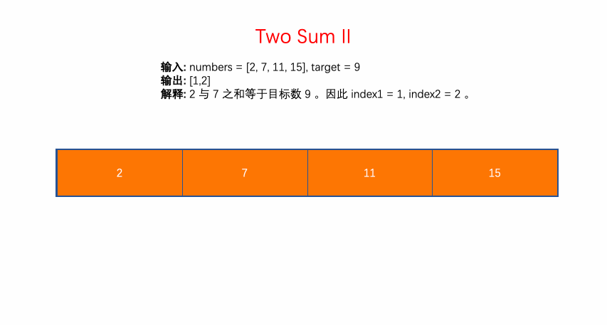

# LeetCode 第 167 号问题：两数之和 II - 输入有序数组

> 本文首发于公众号「图解面试算法」，是 [图解 LeetCode ](<https://github.com/MisterBooo/LeetCodeAnimation>) 系列文章之一。
>
> 同步博客：https://www.algomooc.com

题目来源于 LeetCode 上第 167 号问题：两数之和 II - 输入有序数组。题目难度为 Easy，目前通过率为 48.2% 。

### 题目描述

给定一个已按照**升序排列** 的有序数组，找到两个数使得它们相加之和等于目标数。

函数应该返回这两个下标值 index1 和 index2，其中 index1 必须小于 index2*。*

**说明:**

- 返回的下标值（index1 和 index2）不是从零开始的。
- 你可以假设每个输入只对应唯一的答案，而且你不可以重复使用相同的元素。

**示例:**

```
输入: numbers = [2, 7, 11, 15], target = 9
输出: [1,2]
解释: 2 与 7 之和等于目标数 9 。因此 index1 = 1, index2 = 2 。
```

### 题目解析

初始化左指针 left 指向数组起始，初始化右指针 right 指向数组结尾。

根据**已排序**这个特性，

- （1）如果 numbers[left] 与 numbers[right] 的和 tmp 小于 target ，说明应该增加 tmp ，因此 left 右移指向一个较大的值。
- （2）如果 tmp大于 target ，说明应该减小 tmp ，因此 right 左移指向一个较小的值。
- （3）tmp 等于 target ，则找到，返回 left + 1 和 right + 1。（注意以 1 为起始下标）

### 动画描述



### 代码实现
#### C++
```c++
// 对撞指针
// 时间复杂度: O(n)
// 空间复杂度: O(1)
class Solution {
public:
    vector<int> twoSum(vector<int>& numbers, int target) {
        int n = numbers.size();
        int left = 0;
        int right = n-1;
        while(left <= right)
        {
            if(numbers[left] + numbers[right] == target)
            {
                return {left + 1, right + 1};
            }
            else if (numbers[left] + numbers[right] > target)
            {
                right--;
            }
            else
            {
                left++;
            }
        }
        return {-1, -1};
    }
};
```
#### Java
```java
class Solution {
    public int[] twoSum(int[] numbers, int target) {
        int n = numbers.length;
        int left = 0;
        int right = n-1;
        while(left <= right)
        {
            if(numbers[left] + numbers[right] == target)
            {
                return new int[]{left + 1, right + 1};
            }
            else if (numbers[left] + numbers[right] > target)
            {
                right--;
            }
            else
            {
                left++;
            }
        }
        
        return new int[]{-1, -1};
    }
}
```
#### Python
```python
class Solution(object):
    def twoSum(self, numbers, target):
        n = len(numbers)
        left,right = 0, n-1
        while left <= right:
            if numbers[left]+numbers[right] == target:
                return [left+1, right+1]
            elif numbers[left]+numbers[right] > target:
                right -=1
            else:
                left +=1

        return [-1, -1]
```


