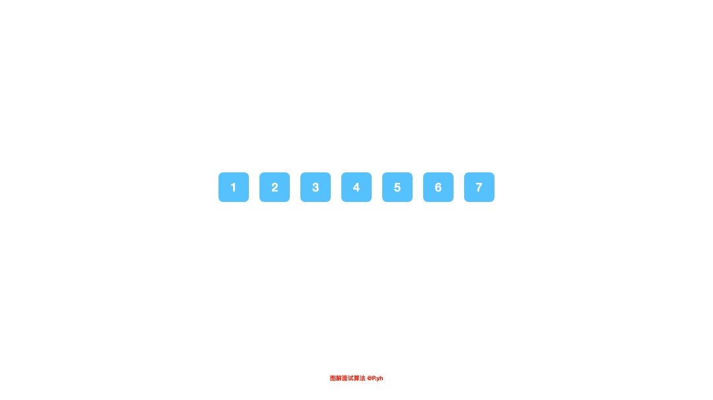

# LeetCode第 189 号问题：旋转数组

> 本文首发于公众号「图解面试算法」，是 [图解 LeetCode ](<https://github.com/MisterBooo/LeetCodeAnimation>) 系列文章之一。
>
> 同步博客：https://www.algomooc.com

题目来源于 LeetCode 上第 189 号问题：旋转数组。题目难度为 Easy，目前通过率为 41.7% 。

### 题目描述

给定一个数组，将数组中的元素向右移动 k 个位置，其中 k 是非负数。

**示例 1:**

```
输入: [1,2,3,4,5,6,7] 和 k = 3
输出: [5,6,7,1,2,3,4]
解释:
向右旋转 1 步: [7,1,2,3,4,5,6]
向右旋转 2 步: [6,7,1,2,3,4,5]
向右旋转 3 步: [5,6,7,1,2,3,4]
```

**示例 2:**

```
输入: [-1,-100,3,99] 和 k = 2
输出: [3,99,-1,-100]
解释: 
向右旋转 1 步: [99,-1,-100,3]
向右旋转 2 步: [3,99,-1,-100]
```

**说明:**

* 尽可能想出更多的解决方案，至少有三种不同的方法可以解决这个问题。
* 要求使用空间复杂度为 O(1) 的 原地 算法。

<br>

### 题目解析

如果没有空间复杂度为 `O(1)` 这个限制，这道题相对来说会简单很多，需要做的仅仅复制一份数组，然后将 `[n - k, n]` 区间上的元素覆盖在数组的开头，接着遍历并覆盖剩下的元素即可。

不能使用额外的空间意味着你只能从数组本身来入手，这里我们可以使用反转数组来解决这道题，这是一个 rotate 数组的小技巧。如果仔细观察，你会发现 **数组经过 rotate 后会变成两个连续的区间段**，这两个区间段中的元素顺序和 rotate 之前的顺序是一样的。首先我们对数组当中所有的元素进行反转，然后分别对这两个区间进行反转，这样就可以保证区间内的顺序和之前一样，你可以看看动图或者自己动手尝试一下，这里并没有复杂的知识点，只是数组操作上的小技巧，了解了之后，可以运用到其他 rotate 数组的场景中。

<br>

### 代码实现

```java
class Solution {
    public void rotate(int[] nums, int k) {
        if (nums.length < k) {
            k %= nums.length;
        }

        reverse(nums, 0, nums.length - 1);
        reverse(nums, 0, k - 1);
        reverse(nums, k, nums.length - 1);
    }

    public void reverse(int[] nums, int start, int end) {
        while (start < end) {
            int tmp = nums[start];
            nums[start] = nums[end];
            nums[end] = tmp;
        }
    }
}
```

<br>

### 动画描述



<br>

### 复杂度分析

空间：O(1)

时间：O(n)


