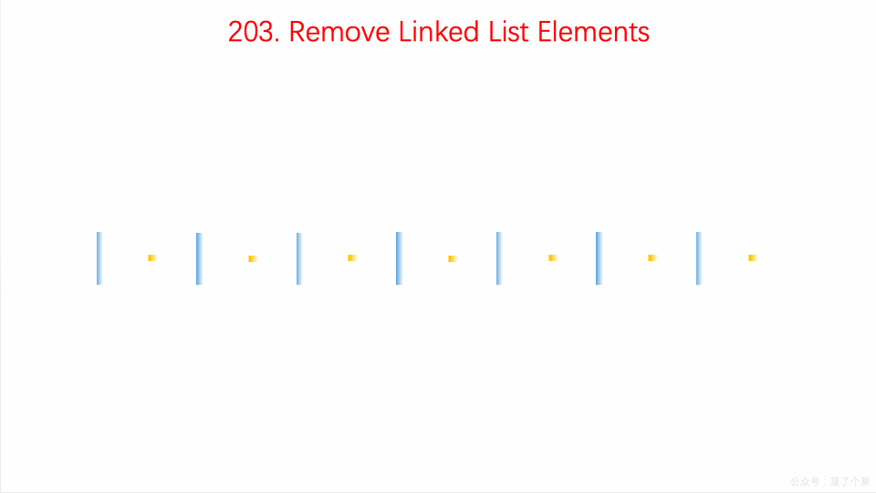

# LeetCode 第 203 号问题：移除链表元素

> 本文首发于公众号「图解面试算法」，是 [图解 LeetCode ](<https://github.com/MisterBooo/LeetCodeAnimation>) 系列文章之一。
>
> 同步博客：https://www.algomooc.com

题目来源于 LeetCode 上第 203 号问题：移除链表元素。题目难度为 Easy，目前通过率为 55.8% 。

### 题目描述

删除链表中等于给定值 **val** 的所有节点。

**示例:**

```
输入: 1->2->6->3->4->5->6, val = 6
输出: 1->2->3->4->5
```

### 题目解析

主要考察了基本的链表遍历和设置指针的知识点。

定义一个虚拟头节点`dummyHead `，遍历查看原链表，遇到与给定值相同的元素，将该元素的前后两个节点连接起来，然后删除该元素即可。

### 动画描述



### 代码实现

#### 代码一

```
// 203. Remove Linked List Elements
// https://leetcode.com/problems/remove-linked-list-elements/description/
// 使用虚拟头结点
// 时间复杂度: O(n)
// 空间复杂度: O(1)
class Solution {
public:
    ListNode* removeElements(ListNode* head, int val) {

        // 创建虚拟头结点
        ListNode* dummyHead = new ListNode(0);
        dummyHead->next = head;

        ListNode* cur = dummyHead;
        while(cur->next != NULL){
            if(cur->next->val == val){
                ListNode* delNode = cur->next;
                cur->next = delNode->next;
                delete delNode;
            }
            else
                cur = cur->next;
        }

        ListNode* retNode = dummyHead->next;
        delete dummyHead;

        return retNode;
    }
};

```

#### 代码二

用递归来解。

通过递归调用到链表末尾，然后回来，需要删的元素，将链表next指针指向下一个元素即可。

```
class Solution {
public:
    ListNode* removeElements(ListNode* head, int val) {
        if (!head) return NULL;
        head->next = removeElements(head->next, val);
        return head->val == val ? head->next : head;
    }
};
```

