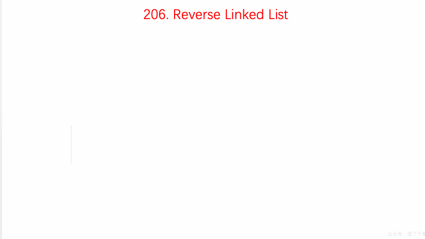

# LeetCode 第 206 号问题：反转链表

> 本文首发于公众号「图解面试算法」，是 [图解 LeetCode ](<https://github.com/MisterBooo/LeetCodeAnimation>) 系列文章之一。
>
> 同步博客：https://www.algomooc.com

题目来源于 LeetCode 上第 206 号问题：反转链表。题目难度为 Easy，目前通过率为 45.8% 。

### 题目描述

反转一个单链表。

**示例:**

```
输入: 1->2->3->4->5->NULL
输出: 5->4->3->2->1->NULL
```

**进阶:**
你可以迭代或递归地反转链表。你能否用两种方法解决这道题？

### 题目解析

设置三个节点`pre`、`cur`、`next`

- （1）每次查看`cur`节点是否为`NULL`，如果是，则结束循环，获得结果
- （2）如果`cur`节点不是为`NULL`，则先设置临时变量`next`为`cur`的下一个节点
- （3）让`cur`的下一个节点变成指向`pre`，而后`pre`移动`cur`，`cur`移动到`next`
- （4）重复（1）（2）（3）

### 动画描述



### 代码实现

```
class Solution {
public:
    ListNode* reverseList(ListNode* head) {
        ListNode* pre = NULL;
        ListNode* cur = head;
        while(cur != NULL){
            ListNode* next = cur->next;
            cur->next = pre;
            pre = cur;
            cur = next;
        }

        return pre;
    }
};
```


