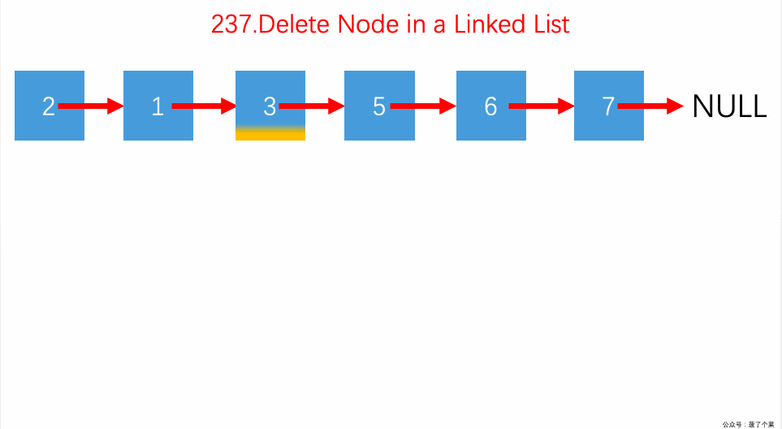

# LeetCode 第 237 号问题：删除链表中的节点

> 本文首发于公众号「图解面试算法」，是 [图解 LeetCode ](<https://github.com/MisterBooo/LeetCodeAnimation>) 系列文章之一。
>
> 同步博客：https://www.algomooc.com

题目来源于 LeetCode 上第 237 号问题：删除链表中的节点。题目难度为 Easy，目前通过率为 72.6% 。

### 题目描述

请编写一个函数，使其可以删除某个链表中给定的（非末尾）节点，你将只被给定要求被删除的节点。

现有一个链表 -- head = [4,5,1,9]，它可以表示为:


 

**示例 1:**

```
输入: head = [4,5,1,9], node = 5
输出: [4,1,9]
解释: 给定你链表中值为 5 的第二个节点，那么在调用了你的函数之后，该链表应变为 4 -> 1 -> 9.
```

**示例 2:**

```
输入: head = [4,5,1,9], node = 1
输出: [4,5,9]
解释: 给定你链表中值为 1 的第三个节点，那么在调用了你的函数之后，该链表应变为 4 -> 5 -> 9.
```

 

**说明:**

- 链表至少包含两个节点。
- 链表中所有节点的值都是唯一的。
- 给定的节点为非末尾节点并且一定是链表中的一个有效节点。
- 不要从你的函数中返回任何结果。

### 题目解析

此题注意的点是没有给我们链表的起点，只给我们了一个要删的节点，与以往处理的情况稍许不同。

**这道题的处理方法是先把当前节点的值用下一个节点的值覆盖，然后我们删除下一个节点即可**

### 动画描述



### 代码实现

```
class Solution {
public:
    void deleteNode(ListNode* node) {
        if (node == NULL) return;
        if (node->next == NULL) {
            delete node;
            node = NULL;
            return;
        }
        node->val = node->next->val;
        ListNode *delNode = node->next;
        node->next = delNode->next;
        
        delete delNode;
    }
};
```


