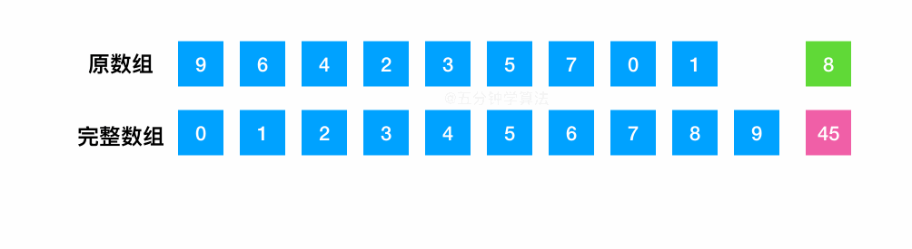

# LeetCode 第 268 号问题：缺失数字

> 本文首发于公众号「图解面试算法」，是 [图解 LeetCode ](<https://github.com/MisterBooo/LeetCodeAnimation>) 系列文章之一。
>
> 同步博客：https://www.algomooc.com

今天分享一道很简单的算法题。

题目来源于 LeetCode 上第 268 号问题：缺失数字。题目难度为 Easy，目前通过率为 50.2% 。

## 题目描述

给定一个包含 `0, 1, 2, ..., n` 中 *n* 个数的序列，找出 0 .. *n* 中没有出现在序列中的那个数。

**说明：**

你的算法应该具有线性时间复杂度。 你可以不使用额外空间来实现吗？


## 题目解析

这道题目有三种解法。

### 解法一：异或法

和之前那道 **只出现一次的数字** 很类似：

> 只出现一次的数字:  给定一个**非空**整数数组，除了某个元素只出现一次以外，其余每个元素均出现两次。找出那个只出现了一次的元素。

如果我们补充一个完整的数组和原数组进行组合，那所求解的问题就变成了 **只出现一次的数字**。

将少了一个数的数组与 0 到 n 之间完整的那个数组进行异或处理，因为相同的数字异或会变为了 0 ，那么全部数字异或后，剩下的就是少了的那个数字。


#### 代码实现1

```java
class Solution {
    public int missingNumber(int[] nums) {
        int res = 0;
        int i = 0;
        //注意数组越界情况
        for (; i < nums.length;i++){
            // i 表示完整数组中的数字，与原数组中的数字 nums[i] 进行异或，再与保存的结果异或
            res = res^i^nums[i];
        }
        //最后需要与循环中无法使用到的那个最大的数异或
        return res^i;
    }
}
```

#### 代码实现2

```java
class Solution {
   public int missingNumber(int[] nums) {
    int res = nums.length;
    for (int i = 0; i < nums.length; ++i){
        res ^= nums[i];
        res ^= i;
    }
    return res;
  }
}
```


### 解法二：求和法

- 求出 0 到 n 之间所有的数字之和
- 遍历数组计算出原始数组中数字的累积和
- 两和相减，差值就是丢失的那个数字



```java
//小吴之前担心会数据溢出，不过估计这题考察的不是这个，所以测试用例没写这种吧，还是能 AC 的
class Solution {
   public int missingNumber(int[] nums) {
        int n = nums.length;
        int sum = (n+0)*(n+1)/2;
        for (int i=0; i<n; i++){
            sum -= nums[i];
        }
        return sum;
 }
}
```


### 解法三：二分法

将数组进行排序后，利用二分查找的方法来找到缺少的数字，注意搜索的范围为 0 到 n 。

- 首先对数组进行排序
- 用元素值和下标值之间做对比，如果元素值大于下标值，则说明缺失的数字在左边，此时将 right 赋为 mid ，反之则将 left 赋为 mid + 1 。

> 注：由于一开始进行了排序操作，因此使用二分法的性能是不如上面两种方法。

```java
public class Solution {
    public int missingNumber(int[] nums) {
        Arrays.sort(nums);
        int left = 0;
        int right = nums.length;
        while (left < right){
            int mid = (left + right) / 2;
            if (nums[mid] > mid){
                right = mid;
            }else{
                left = mid + 1;  
            }
        }
        return left;
    }
}
```


