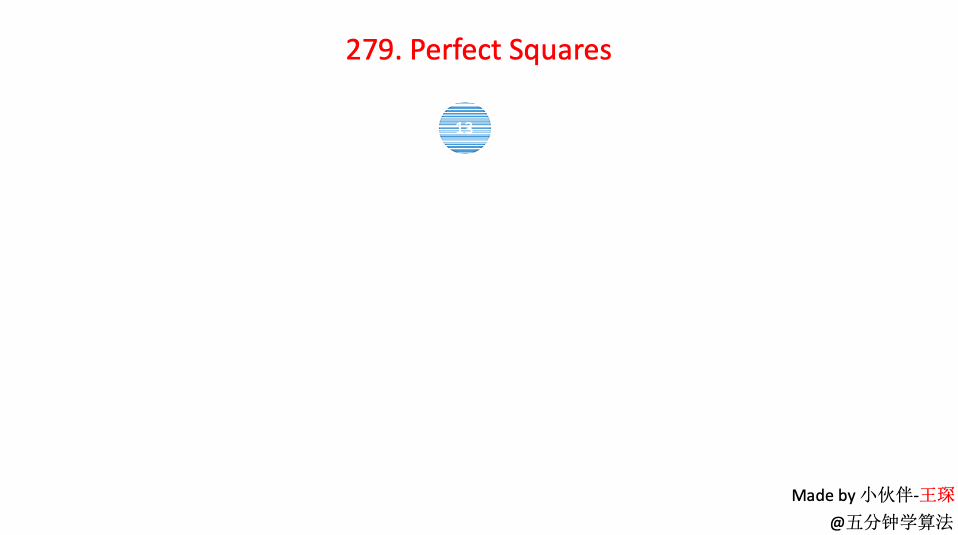

# LeetCode 第 279 号问题：完全平方数

> 本文首发于公众号「图解面试算法」，是 [图解 LeetCode ](<https://github.com/MisterBooo/LeetCodeAnimation>) 系列文章之一。
>
> 同步博客：https://www.algomooc.com

题目来源于 LeetCode 上第 279 号问题：完全平方数。题目难度为 Medium，目前通过率为 49.1% 。

### 题目描述

给定正整数 *n*，找到若干个完全平方数（比如 `1, 4, 9, 16, ...`）使得它们的和等于 *n*。你需要让组成和的完全平方数的个数最少。

**示例 1:**

```
输入: n = 12
输出: 3 
解释: 12 = 4 + 4 + 4.
```

**示例 2:**

```
输入: n = 13
输出: 2
解释: 13 = 4 + 9.
```

### 题目解析

这道题目很有意思。

大部分文章给出的答案都是依托于一个定理：**四平方定理**。

四平方定理讲的就是任何一个正整数都可以表示成不超过四个整数的平方之和。也就是说，这道题的答案只有 1，2 ，3，4 这四种可能。

同时，还有一个非常重要的推论满足四数平方和定理的数n（这里要满足由四个数构成，小于四个不行），必定满足 n = 4<sup>a</sup> * (8b + 7)。

根据这个重要的推论来解决此题，首先将输入的`n`迅速缩小。然后再判断，这个缩小后的数是否可以通过`两个平方数的和或一个平方数`组成，不能的话我们返回`3`，能的话我们返回`平方数的个数`。

所以代码很简洁，如下：

```java
public int numSquares(int n) {
        while (n % 4 == 0){
            n /= 4;
        }
        if ( n % 8 == 7){
            return 4;
        }
        int a = 0;
        while ( (a * a) <= n){
            int b = (int)Math.pow((n - a * a),0.5);
             if(a * a + b * b == n) {
            //如果可以 在这里返回
            if(a != 0 && b != 0) {
                return 2;
            } else{
                return 1;
            }
        }
        a++;
     }
        return 3;
}
```


但因为本章是「广度优先遍历」的专栏，因此再补充一个图的广度优先遍历的答案：

使用广度优先搜索方法，将 n 依次减去比 n 小的所有平方数，直至 n = 0 ，此时的层数即为最后的结果。

### 动画描述



### 代码实现

```
import java.util.LinkedList;
import javafx.util.Pair;
class Solution {
    public int numSquares(int n) {
         if(n == 0)
            return 0;
            
        LinkedList<Pair<Integer, Integer>> queue = new LinkedList<Pair<Integer, Integer>>();
        queue.addLast(new Pair<Integer, Integer>(n, 0));

        boolean[] visited = new boolean[n+1];
        visited[n] = true;

        while(!queue.isEmpty()){
            Pair<Integer, Integer> front = queue.removeFirst();
            int num = front.getKey();
            int step = front.getValue();

            if(num == 0)
                return step;

            for(int i = 1 ; num - i*i >= 0 ; i ++){
                int a = num - i*i;
                if(!visited[a]){
                    if(a == 0) return step + 1;
                    queue.addLast(new Pair(num - i * i, step + 1));
                    visited[num - i * i] = true;
                }
            }
        }
        return 0;
    }
}
```


