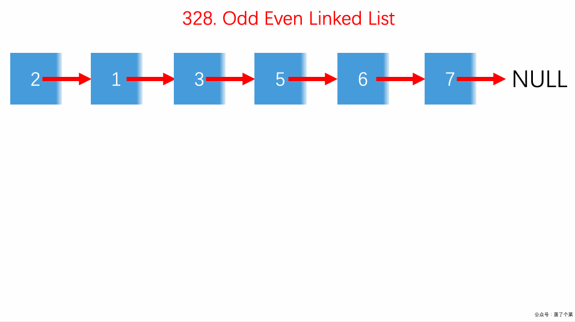

# LeetCode 第 328 号问题：奇偶链表

> 本文首发于公众号「图解面试算法」，是 [图解 LeetCode ](<https://github.com/MisterBooo/LeetCodeAnimation>) 系列文章之一。
>
> 同步博客：https://www.algomooc.com

题目来源于 LeetCode 上第 328 号问题：奇偶链表。题目难度为 Medium，目前通过率为 52.0% 。

### 题目描述

给定一个单链表，把所有的奇数节点和偶数节点分别排在一起。请注意，这里的奇数节点和偶数节点指的是节点编号的奇偶性，而不是节点的值的奇偶性。

请尝试使用原地算法完成。你的算法的空间复杂度应为 O(1)，时间复杂度应为 O(nodes)，nodes 为节点总数。

**示例 1:**

```
输入: 1->2->3->4->5->NULL
输出: 1->3->5->2->4->NULL
```

**示例 2:**

```
输入: 2->1->3->5->6->4->7->NULL 
输出: 2->3->6->7->1->5->4->NULL
```

**说明:**

- 应当保持奇数节点和偶数节点的相对顺序。
- 链表的第一个节点视为奇数节点，第二个节点视为偶数节点，以此类推。

### 题目解析

这道题给了我们一个链表，让我们分开奇偶节点，所有奇节点在前，偶节点在后。

* 设定两个虚拟节点，`dummyHead1 `用来保存奇节点，`dummyHead2 `来保存偶节点；
* 遍历整个原始链表，将奇节点放于`dummyHead1 `中，其余的放置在`dummyHead2 `中
* 遍历结束后，将`dummyHead2 `插入到`dummyHead1 `后面

### 动画描述



### 代码实现

```
class Solution {
public:
    ListNode* oddEvenList(ListNode* head) {

        if(head == NULL || head->next == NULL || head->next->next == NULL)
            return head;

        ListNode* dummyHead1 = new ListNode(-1);
        ListNode* dummyHead2 = new ListNode(-1);
        ListNode* p1 = dummyHead1;
        ListNode* p2 = dummyHead2;
        ListNode* p = head;
        for(int i = 0; p; i ++)
            if(i % 2 == 0){
                p1->next = p;
                p = p->next;
                p1 = p1->next;
                p1->next = NULL;
            }
            else{
                p2->next = p;
                p = p->next;
                p2 = p2->next;
                p2->next = NULL;
            }

        p1->next = dummyHead2->next;
        ListNode* ret = dummyHead1->next;

        delete dummyHead1;
        delete dummyHead2;
        return ret;
    }
};
```


