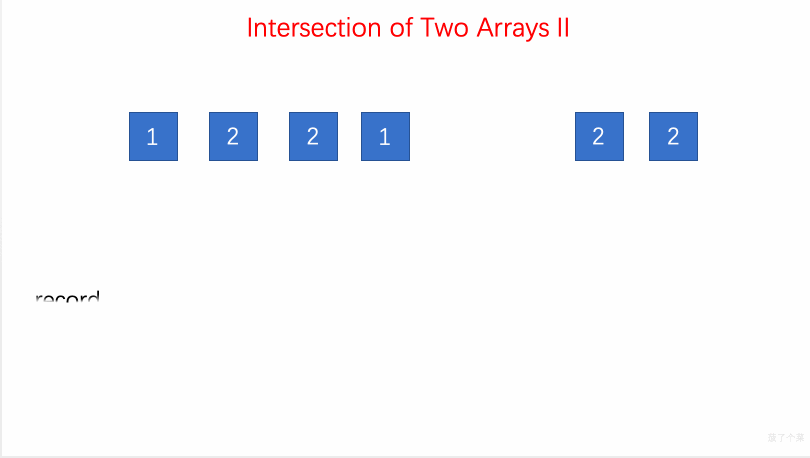

# LeetCode 第 350 号问题：两个数组的交集 II

> 本文首发于公众号「图解面试算法」，是 [图解 LeetCode ](<https://github.com/MisterBooo/LeetCodeAnimation>) 系列文章之一。
>
> 同步博客：https://www.algomooc.com

题目来源于 LeetCode 上第 350 号问题：两个数组的交集 II。题目难度为 Easy，目前通过率为 41.8% 。

### 题目描述

给定两个数组，编写一个函数来计算它们的交集。

**示例 1:**

```
输入: nums1 = [1,2,2,1], nums2 = [2,2]
输出: [2,2]
```

**示例 2:**

```
输入: nums1 = [4,9,5], nums2 = [9,4,9,8,4]
输出: [4,9]
```

**说明：**

- 输出结果中每个元素出现的次数，应与元素在两个数组中出现的次数一致。
- 我们可以不考虑输出结果的顺序。

**进阶:**

- 如果给定的数组已经排好序呢？你将如何优化你的算法？
- 如果 *nums1* 的大小比 *nums2* 小很多，哪种方法更优？
- 如果 *nums2* 的元素存储在磁盘上，磁盘内存是有限的，并且你不能一次加载所有的元素到内存中，你该怎么办？

### 题目解析

容器类 [map](https://zh.cppreference.com/w/cpp/container/map) 的使用。

- 遍历 num1，通过map容器 record 存储 num1 的元素与频率
- 遍历 num2 ，在 record 中查找是否有相同的元素（该元素的存储频率大于0），如果有，用map容器resultVector 进行存储，同时该元素的频率减一

### 动画描述



### 代码实现

```
// 350. Intersection of Two Arrays II
// https://leetcode.com/problems/intersection-of-two-arrays-ii/description/
// 时间复杂度: O(nlogn)
// 空间复杂度: O(n)
class Solution {
public:
    vector<int> intersect(vector<int>& nums1, vector<int>& nums2) {

        map<int, int> record;
        for(int i = 0 ; i < nums1.size() ; i ++){
             record[nums1[i]] += 1;
        }
        
        vector<int> resultVector;
        for(int i = 0 ; i < nums2.size() ; i ++){
            if(record[nums2[i]] > 0){
                resultVector.push_back(nums2[i]);
                record[nums2[i]] --;
            }
        }
        
        return resultVector;
    }
};
```


