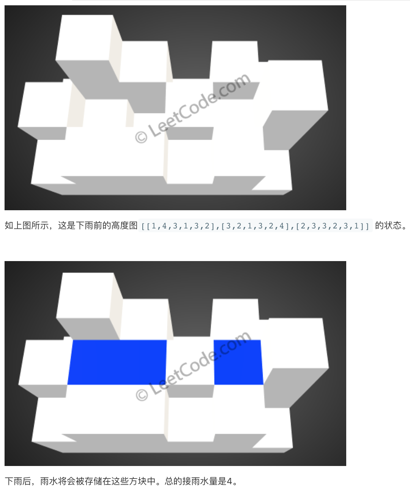

# LeetCode 第 407 号问题：接雨水 II

> 本文首发于公众号「图解面试算法」，是 [图解 LeetCode ](<https://github.com/MisterBooo/LeetCodeAnimation>) 系列文章之一。
>
> 同步博客：https://www.algomooc.com

题目来源于 LeetCode 上第 407 号问题：接雨水 II。题目难度为 Hard，目前通过率为 38% 。

### 题目描述

给你一个 m x n 的矩阵，其中的值均为正整数，代表二维高度图每个单元的高度，请计算图中形状最多能接多少体积的雨水。

**示例:**

```
给出如下 3x6 的高度图:
[
  [1,4,3,1,3,2],
  [3,2,1,3,2,4],
  [2,3,3,2,3,1]
]

返回 4 。
```



### 题目解析

在 1 个 2 维的矩阵中，每个格子都有其高度，问这个 2 维矩阵能够盛多少的水。首先我们分析，格子能够盛水的必要条件是其周围存在格子比当前格子高，这样水才能够被框得住，但是仔细一想，最外围的格子怎么办？它们是存不了水的，可以把最外围的格子想象成围栏，它们的作用就是保证里面格子的水不会流出来，所以我们就得先考虑这些格子，它们的高度直接决定了内部格子的蓄水量，但是这些格子也有局部性，一个格子的长短并不会影响矩阵当中所有的格子，但是它会影响与其相邻的格子，那么我们就需要有一个考虑的顺序，那就是优先考虑最外层最短的格子，由于每个格子都会影响到其周围的格子，内部格子也需要列入考虑范围，每次我们都考虑最短的格子，然后看其周围有没有没考虑过的比它还短的格子，于是就有了考虑的先后顺序：

1. 考虑最外层格子
2. 选出最外层最短的格子
3. 考虑该格子与其相邻的内部格子是否能盛水，并把这个内部格子也纳入考虑范围
4. 在考虑范围内的所有格子中选出最短的格子，重复步骤 3

这里需要注意的是，每次纳入考虑范围的格子是加了水之后的高度，而不是之前的高度，原因想一下应该不难理解。另外就是可以使用了 “堆” 这个数据结构来帮助实现寻找 “当前考虑范围内最短的格子” 这个操作步骤。

### 动画描述


### 代码实现

```java
private class Pair {
    int x, y, h;
    Pair(int x, int y, int h) {
        this.x = x;
        this.y = y;
        this.h = h;
    }
}

private int[] dirX = {0, 0, -1, 1};
private int[] dirY = {-1, 1, 0, 0};

public int trapRainWater(int[][] heightMap) {
    if (heightMap.length == 0 || heightMap[0].length == 0) {
        return 0;
    }
    
    int m = heightMap.length;
    int n = heightMap[0].length;
    
    PriorityQueue<Pair> pq = new PriorityQueue<>(new Comparator<Pair>() {
        @Override
        public int compare(Pair a, Pair b) {
            return a.h - b.h;
        }
    });
    
    boolean[][] visited = new boolean[m][n];
    
    // 优先将外围的元素加入队列中
    for (int i = 0; i < n; ++i) {
        pq.offer(new Pair(0, i, heightMap[0][i]));
        pq.offer(new Pair(m - 1, i, heightMap[m - 1][i]));
        
        visited[0][i] = true;
        visited[m - 1][i] = true;
    }
    
    for (int i = 1; i < m - 1; ++i) {
        pq.offer(new Pair(i, 0, heightMap[i][0]));
        pq.offer(new Pair(i, n - 1, heightMap[i][n - 1]));
        
        visited[i][0] = true;
        visited[i][n - 1] = true;
    }
    
    int result = 0;
    while (!pq.isEmpty()) {
        Pair cur = pq.poll();

        // 遍历当前位置上下左右四个方向
        for (int k = 0; k < 4; ++k) {
            int curX = cur.x + dirX[k];
            int curY = cur.y + dirY[k];
            
            if (curX < 0 || curY < 0 || curX >= m || curY >= n || visited[curX][curY]) {
                continue;
            }
            
            if (heightMap[curX][curY] < cur.h) {
                result += cur.h - heightMap[curX][curY];
            }
            
            pq.offer(new Pair(curX, curY, 
                              Math.max(heightMap[curX][curY], cur.h)));
            visited[curX][curY] = true;
        }
    }
    
    return result;
}
```

<br>

### 复杂度分析

因为使用了优先队列这个数据结构，每次元素出入队列的时间复杂度是 O(logn)，于是我们可以得出整体时间复杂度是 `O(m*n*logm*n)`，当然，需要说明的是，这是最差时间复杂度，由于并不是所有的元素都一次性加入队列，平均时间复杂度要比这个来的低，具体是什么就得看输入数据了。空间复杂度是 `O(m*n)`，这里也不难理解。通过这道题，堆的用法又被很好地展现了出来。


