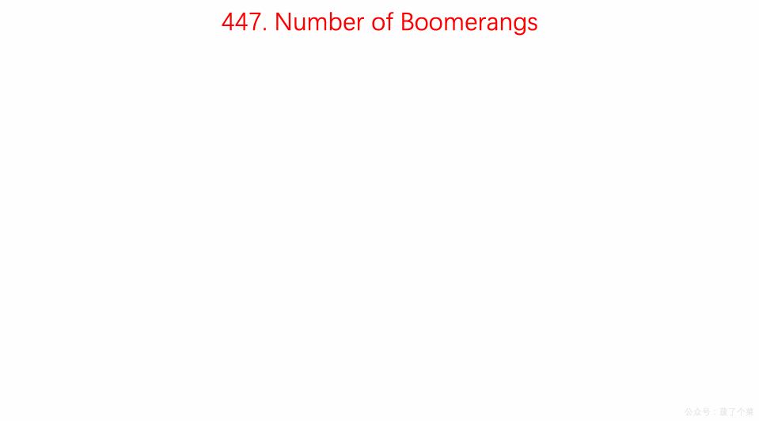

# LeetCode第447号问题：回旋镖的数量

> 本文首发于公众号「图解面试算法」，是 [图解 LeetCode ](<https://github.com/MisterBooo/LeetCodeAnimation>) 系列文章之一。
>
> 同步博客：https://www.algomooc.com

题目来源于 LeetCode 上第 447 号问题：回旋镖的数量。题目难度为 Easy，目前通过率为 45.8% 。

### 题目描述

给定平面上 *n* 对不同的点，“回旋镖” 是由点表示的元组 `(i, j, k)` ，其中 `i` 和 `j` 之间的距离和 `i` 和 `k` 之间的距离相等（**需要考虑元组的顺序**）。

找到所有回旋镖的数量。你可以假设 *n* 最大为 **500**，所有点的坐标在闭区间 **[-10000, 10000]** 中。

**示例:**

```
输入:
[[0,0],[1,0],[2,0]]

输出:
2

解释:
两个回旋镖为 [[1,0],[0,0],[2,0]] 和 [[1,0],[2,0],[0,0]]
```

### 题目解析

n 最大为 500，可以使用时间复杂度为 O(n^2)的算法。

- 遍历所有的点，让每个点作为一个锚点
- 然后再遍历其他的点，统计和锚点距离相等的点有多少个
- 然后分别带入 n(n-1) 计算结果并累加到res中

##### Tips：

###### Tip1

- 如果有一个点 a，还有两个点 b 和 c ，如果 ab 和 ac 之间的距离相等，那么就有两种排列方法 abc 和 acb；
- 如果有三个点 b，c，d都分别和a之间的距离相等，那么有六种排列方法，abc, acb, acd, adc, abd, adb；
- 如果有 n 个点和点 a 距离相等，那么排列方式为 n(n-1)。

###### Tip2

- 计算距离时不进行开根运算, 以保证精度；
- 只有当n大于等于2时，res值才会真正增加，因为当n=1时，增加量为`1*(1-1)=0`。


### 动画描述



### 代码实现

```
// 447. Number of Boomerangs
// https://leetcode.com/problems/number-of-boomerangs/description/
// 时间复杂度: O(n^2)
// 空间复杂度: O(n)
class Solution {
public:
    int numberOfBoomerangs(vector<pair<int, int>>& points) {

        int res = 0;
        for( int i = 0 ; i < points.size() ; i ++ ){

            // record中存储 点i 到所有其他点的距离出现的频次
            unordered_map<int, int> record;
            for(int j = 0 ; j < points.size() ; j ++){
                if(j != i){
                    // 计算距离时不进行开根运算, 以保证精度
                    record[dis(points[i], points[j])] += 1;
                }
            }
            
            for(unordered_map<int, int>::iterator iter = record.begin() ; iter != record.end() ; iter ++){
                res += (iter->second) * (iter->second - 1);
            }
        }
        return res;
    }

private:
    int dis(const pair<int,int> &pa, const pair<int,int> &pb){
        return (pa.first - pb.first) * (pa.first - pb.first) +
               (pa.second - pb.second) * (pa.second - pb.second);
    }
};


```


