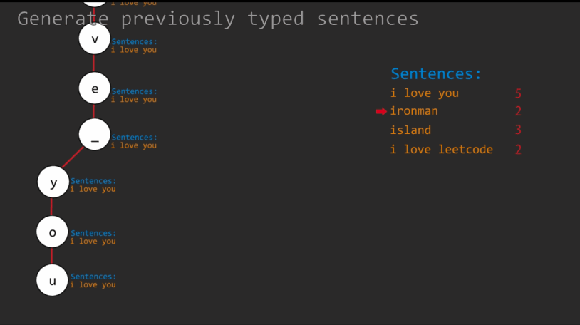

# LeetCode 第 642 号问题：设计一个搜索自动完成系统

> 本文首发于公众号「图解面试算法」，是 [图解 LeetCode ](<https://github.com/MisterBooo/LeetCodeAnimation>) 系列文章之一。
>
> 同步博客：https://www.algomooc.com

题目来源于 LeetCode 上第 642 号问题：设计一个搜索自动完成系统。题目难度为 Hard，目前通过率为 37.8% 。

### 题目描述

为搜索引擎设计一个搜索自动完成系统。用户可以输入一个句子(至少一个单词，并以一个特殊的字符'#'结尾)。对于除'#'之外的每个字符，您需要返回与已输入的句子部分前缀相同的前3个历史热门句子。具体规则如下:

一个句子的热度定义为用户输入完全相同句子的次数。
返回的前3个热门句子应该按照热门程度排序(第一个是最热的)。如果几个句子的热度相同，则需要使用ascii代码顺序(先显示较小的一个)。
如果少于3个热门句子，那么就尽可能多地返回。
当输入是一个特殊字符时，它意味着句子结束，在这种情况下，您需要返回一个空列表。
您的工作是实现以下功能:

构造函数:

AutocompleteSystem(String[] sentence, int[] times):这是构造函数。输入是历史数据。句子是由之前输入的句子组成的字符串数组。Times是输入一个句子的相应次数。您的系统应该记录这些历史数据。

现在，用户想要输入一个新句子。下面的函数将提供用户类型的下一个字符:

List<String> input(char c):输入c是用户输入的下一个字符。字符只能是小写字母(“a”到“z”)、空格(“”)或特殊字符(“#”)。另外，前面输入的句子应该记录在系统中。输出将是前3个历史热门句子，它们的前缀与已经输入的句子部分相同。

例子:
操作:AutocompleteSystem(["i love you"， "island"，"ironman"， "i love leetcode"]， [5,3,2,2])
系统已经追踪到以下句子及其对应的时间:

"i love you" : 5 times 
"island" : 3 times 
"ironman" : 2 times 
"i love leetcode" : 2 times 

现在，用户开始另一个搜索:

操作:输入(“i”)
输出:["i love you"， "island"，"i love leetcode"]
解释:
有四个句子有前缀“i”。其中，《ironman》和《i love leetcode》有着相同的热度。既然“ ” ASCII码为32，“r”ASCII码为114，那么“i love leetcode”应该在“ironman”前面。此外，我们只需要输出前3个热门句子，所以“ironman”将被忽略。

操作:输入(' ')
输出:[“i love you”，“i love leetcode”]
解释:
只有两个句子有前缀“i”。

操作:输入(' a ')
输出:[]
解释:
没有以“i a”为前缀的句子。

操作:输入(“#”)
输出:[]
解释:
用户完成输入后，在系统中将句子“i a”保存为历史句。下面的输入将被计算为新的搜索。

注意:

输入的句子总是以字母开头，以“#”结尾，两个单词之间只有一个空格。
要搜索的完整句子不会超过100个。包括历史数据在内的每句话的长度不会超过100句。
在编写测试用例时，即使是字符输入，也请使用双引号而不是单引号。
请记住重置在AutocompleteSystem类中声明的类变量，因为静态/类变量是跨多个测试用例持久化的。详情请点击这里。

### 题目解析

设计一个搜索自动补全系统，它需要包含如下两个方法：

#### 构造方法：

AutocompleteSystem(String[] sentences, int[] times): 输入句子sentences，及其出现次数times

#### 输入方法：

List<String> input(char c): 输入字符c可以是26个小写英文字母，也可以是空格，以'#'结尾。返回输入字符前缀对应频率最高的至多3个句子，频率相等时按字典序排列。

### 思路解析：

核心点：Trie（字典树）

利用字典树记录所有出现过的句子集合，利用字典保存每个句子出现的次数。

#### 解题思路

题目的要求是补全的句子是按之前出现的频率排列的，高频率的出现在最上面，如果频率相同，就按字母顺序来显示。

频率 这种要求很容易想到 堆、优先队列、树、Map等知识点，这里涉及到 字典 与 树，那肯定使用 字典树 能解决。

所以首先构造 Trie 的 trieNode 结构以及 insert 方法，构造完 trieNode 类后，再构造一个树的根节点。

由于每次都要输入一个字符，我们可以用一个私有的 Node：curNode 来追踪当前的节点。

curNode 初始化为 root ，在每次输入完一个句子时，即输入的字符为‘#’时，我们需要将其置为root。

同时还需要一个 string 类型 stn 来表示当前的搜索的句子。

每输入一个字符，首先检查是不是结尾标识“#”，如果是的话，将当前句子加入trie树，重置相关变量，返回空数组。

* 如不是，检查当前 TrieNode 对应的 child 是否含有 c 的对应节点。如果没有，将 curNode 置为 NULL 并且返回空数组。

* 若存在，将curNode 更新为c对应的节点，并且对curNode进行dfs。

dfs 时，我们首先检查当前是不是一个完整的句子，如果是，将句子与其次数同时加入 priority_queue 中，然后对其 child 中可能存在的子节点进行 dfs 。

进行完 dfs 后，只需要取出前三个，需要注意的是，可能可选择的结果不满3个，所以要在 while 中多加入检测 q 为空的条件语句。

最后要将 q 中的所有元素都弹出。

### 动画描述



### 代码实现

#### C++
```
class TrieNode{
  public:
    string str;
    int cnt;
    unordered_map<char, TrieNode*> child;
    TrieNode(): str(""), cnt(0){};
};

struct cmp{
    bool operator() (const pair<string, int> &p1, const pair<string, int> &p2){
        return p1.second < p2.second || (p1.second == p2.second && p1.first > p2.first);
    }
};

class AutocompleteSystem {
public:
    AutocompleteSystem(vector<string> sentences, vector<int> times) {
        root = new TrieNode();
        for(int i = 0; i < sentences.size(); i++){
            insert(sentences[i], times[i]);
        }
        curNode = root;
        stn = "";
    }
    
    vector<string> input(char c) {
        if(c == '#'){
            insert(stn, 1);
            stn.clear();
            curNode = root;
            return {};
        }
        stn.push_back(c);
        if(curNode && curNode->child.count(c)){
            curNode = curNode->child[c];
        }else{
            curNode = NULL;
            return {};
        }
        
        dfs(curNode);
        
        vector<string> ret;
        int n = 3;
        while(n > 0 && !q.empty()){
            ret.push_back(q.top().first);
            q.pop();
            n--;
        }
        while(!q.empty()) q.pop();
        
        return ret;
    }
    
    void dfs(TrieNode* n){
        if(n->str != ""){
            q.push({n->str, n->cnt});
        }
        for(auto p : n->child){
            dfs(p.second);
        }
    }
    
    void insert(string s, int cnt){
        TrieNode* cur = root;
        for(auto c : s){
            if(cur->child.count(c) == 0){
                cur->child[c] = new TrieNode();
            }
            cur = cur->child[c];
        }
        cur->str = s;
        cur->cnt += cnt;
    }
    
private:
    TrieNode *root, *curNode;
    string stn;
    priority_queue<pair<string,int>, vector<pair<string, int>>, cmp > q;
    
};

```


