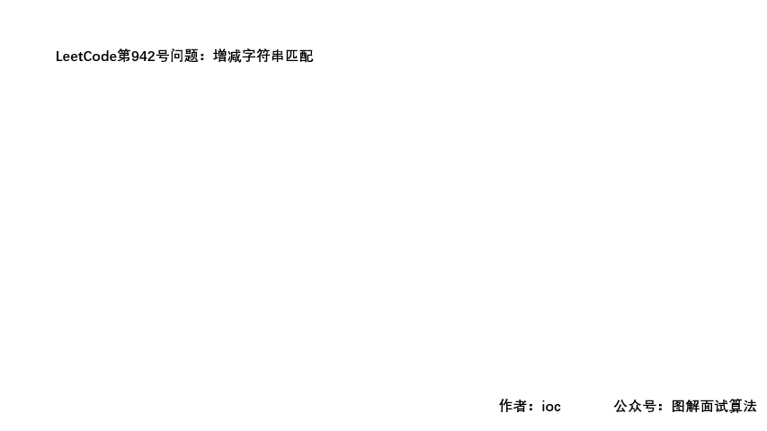

## LeetCode第942号问题：增减字符串匹配

> 本文首发于公众号「图解面试算法」，是 [图解 LeetCode ](<https://github.com/MisterBooo/LeetCodeAnimation>) 系列文章之一。
>
> 同步个人博客：www.zhangxiaoshuai.fun

本题在leetcode中题目序号942，属于easy级别，目前通过率为71.4%

### 题目描述：

```
给定只含 "I"（增大）或 "D"（减小）的字符串 S ，令 N = S.length。
返回 [0, 1, ..., N] 的任意排列 A 使得对于所有 i = 0, ..., N-1，都有：
    如果 S[i] == "I"，那么 A[i] < A[i+1]
    如果 S[i] == "D"，那么 A[i] > A[i+1]

示例 1：
输出："IDID"
输出：[0,4,1,3,2]

示例 2：
输出："III"
输出：[0,1,2,3]

示例 3：
输出："DDI"
输出：[3,2,0,1]

提示：
    1 <= S.length <= 10000
    S 只包含字符 "I" 或 "D"
```

**题目分析：**

```
题目中的意思很明确，我们只要满足给出的两个条件即可。

1.假如字符串的长度为N，那么目标数组的长度就为N+1；

2.数组中的数字都是从0~N，且没有重复；

3.遇见‘I’，要增加；遇见‘D’要减少；
```

### GIF动画演示：



### 代码：

```java
//这里搬运下官方的解法
public int[] diStringMatch(String S) {
    int N = S.length();
    int lo = 0, hi = N;
    int[] ans = new int[N + 1];
    for (int i = 0; i < N; ++i) {
        if (S.charAt(i) == 'I')
            ans[i] = lo++;
        else
            ans[i] = hi--;
    }
    ans[N] = lo;
    return ans;
}
```

**虽然上述代码很简洁，好像已经不需要我们去实现什么；但是满足条件的序列并不止一种，官方的好像只能通过一种，下面的代码虽然有些冗余，但是得出的序列是满足题意要求的，但是并不能AC；**

### 思路：

```
(1)如果遇见的是‘I’，那么对应数组当前位置的数字要小于它右边的第一个数字
(2)如果遇见的是‘D’，那么对应数组当前位置的数字要大于它右边的第一个数字

首先对目标数组进行初始化，赋值0~N
我们开始遍历字符串，如果遇见‘I’就判断对应数组该位置上的数是否满足（1）号条件
如果满足，跳过本次循环；如果不满足，交换两个数字的位置；
对于‘D’，也是同样的思路；
```

### GIF动画演示：


### 代码：

```java
public int[] diStringMatch(String S) {
    int[] res = new int[S.length()+1];
    String[] s = S.split("");
    for (int i = 0; i < res.length; i++) {
        res[i] = i;
    }
    for (int i = 0; i < s.length; i++) {
        if (s[i].equals("I")) {
            //判断指定位置的数字是否符合条件
            if (res[i] < res[i + 1]) {
                continue;
            } else {
                //交换两个数字的位置
                res[i]   = res[i] ^ res[i+1];
                res[i+1] = res[i] ^ res[i+1];
                res[i]   = res[i] ^ res[i+1];
            }
        } else {
            if (res[i] > res[i + 1]) {
                continue;
            } else {
                res[i]   = res[i] ^ res[i+1];
                res[i+1] = res[i] ^ res[i+1];
                res[i]   = res[i] ^ res[i+1];
            }
        }
    }
    return res;
}
```

**以上内容如有错误、不当之处，欢迎批评指正。**