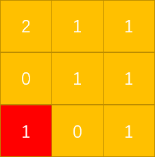

## LeetCode第994号问题：腐烂的橘子

> 本文首发于公众号「图解面试算法」，是 [图解 LeetCode ](<https://github.com/MisterBooo/LeetCodeAnimation>) 系列文章之一。
>
> 同步个人博客：www.zhangxiaoshuai.fun

本题在leetcode中题目序号994，属于medium级别，目前通过率为50.7%

**题目描述：**

```
在给定的网格中，每个单元格可以有以下三个值之一：
	值0代表空单元格；
	值1代表新鲜橘子；
	值2代表腐烂的橘子。
每分钟，任何与腐烂的橘子（在4个正方向上）相邻的新鲜橘子都会腐烂。返回直到单元格中没有新鲜橘子为止所必须经过的最小分钟数。如果不可能，返回-1。

示例1：
	输入：[[2,1,1],[1,1,0],[0,1,1]]
	输出：4

示例2：
	输入：[[2,1,1],[0,1,1],[1,0,1]]
	输出：-1
	解释：左下角的橘子（第2行，第0列）永远不会腐烂，因为腐烂只会发生在4个正向上。

示例3：
	输入：[[0,2]]
	输出：0
	解释：因为0分钟时已经没有新鲜橘子了，所以答案就是0。

提示：
	1<=grid.length<=10
	1<=grid[0].length<=10
	grid[i][j]仅为0、1或2
```

**由题意：只有腐烂的橘子才可以去污染它周围四个方向上存在的新鲜橘子，且它每一分钟只能污染一次，下一次，被它腐蚀的橘子再去腐蚀自己周边的新鲜橘子，每次只有被新腐蚀的橘子才能继续向外腐蚀（因为旧的腐烂的橘子已经被“包围”了）**

这就很像一个人得了传染病，只要他遇见人就会将病传染给那个人，而被传染的又会去感染别的人（不同的是，这里的橘子的位置是固定的，无法移动）

思路是非常简单的，我们通过动态图直观理解下：


既然理清了思路，那么我们来试试代码：
首先，我们需要知道初始状态下的单元格中有多少腐烂的橘子，并且要将它们的位置信息保存下来，我们可以用一个队列（**先入先出**）将（x，y）保存下来;然后我们开始遍历整个队列，每次弹出一个保存的位置信息，将这个位置周围的新鲜橘子全部腐蚀，并且将被腐蚀的橘子的位置信息存入队列中，在下次循环中从它们的位置上再“**向外延伸**”（注意：为了模拟同步，我们需要将每次存入队列中的所有位置都要在下一次全部取出来）；直到队列为空，循环结束，这个时候并不能说明整个单元格中已经不存在新鲜的橘子，因为可能存在下面这种情况：



很明显，标红的区域（新鲜橘子）永远不能被腐蚀，因为它周围唯一的两个单元格是空的。

那么针对这种情况，我们在前面遍历统计腐烂橘子的时候可以顺便统计一下新鲜橘子的数量count，后面我们每腐蚀一个橘子就从count中减去1。最终循环结束的时候，我们只需要判断count是否大于0，若是，返回-1，否则返回轮数res。

------

**代码：**

```java
public static int orangesRotting02(int[][] grid){
    int row = grid.length,col = grid[0].length;
    Queue<int[]> queue = new ArrayDeque();
    int count = 0;//统计新鲜橘子的数量
    for (int i = 0; i < row; i++) {
        for (int j = 0; j < col; j++) {
            if (grid[i][j] == 2) {
                queue.add(new int[]{i,j});
            }
            if (grid[i][j] == 1) {
                count++;
            }
        }
    }
    int res = 0;
    while (count > 0 && !queue.isEmpty()) {
        res++;
        int size = queue.size();
        for (int i = 0; i < size; i++) {
            int[] temp = queue.poll();
            int r = temp[0],c = temp[1];//(x,y)
            //上
            if (r > 0 && grid[r-1][c] == 1) {
                grid[r-1][c] = 2;
                count--;
                queue.add(new int[]{r-1,c});
            }
            //下
            if (r < grid.length-1 && grid[r+1][c] == 1) {
                grid[r+1][c] = 2;
                count--;
                queue.add(new int[]{r+1,c});
            }
            //左
            if (c > 0 && grid[r][c-1] == 1) {
                grid[r][c-1] = 2;
                count--;
                queue.add(new int[]{r,c-1});
            }
            //右
            if (c < grid[0].length-1 && grid[r][c+1] == 1) {
                grid[r][c+1] = 2;
                count--;
                queue.add(new int[]{r,c+1});
            }
        }
    }
    if (count > 0) {
        return -1;
    }
    return res;
}
```