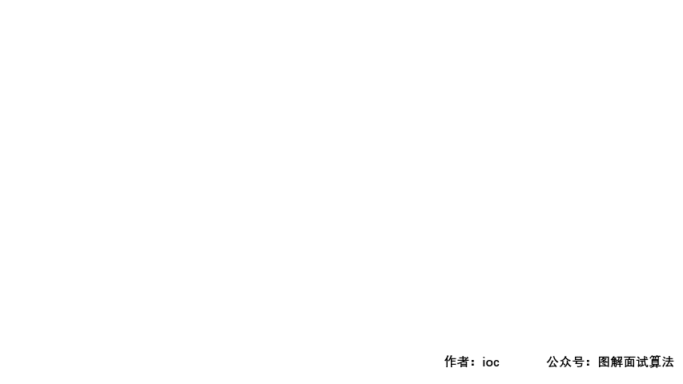

## LeetCode第1054号问题：距离相等的条形码

> 本文首发于公众号「图解面试算法」，是 [图解 LeetCode ](<https://github.com/MisterBooo/LeetCodeAnimation>) 系列文章之一。
>
> 同步个人博客：www.zhangxiaoshuai.fun

**本题选自leetcode第1054号问题，medium级别，目前通过率33.3%**

**题目描述：**

	在一个仓库里，有一排条形码，其中第 i 个条形码为 barcodes[i]。
	请你重新排列这些条形码，使其中两个相邻的条形码不能相等。
	你可以返回任何满足该要求的答案，此题保证存在答案。
	示例 1：
	输入：[1,1,1,2,2,2]
	输出：[2,1,2,1,2,1]
	
	示例 2：
	输入：[1,1,1,1,2,2,3,3]
	输出：[1,3,1,3,2,1,2,1]
	
	提示：
	    1 <= barcodes.length <= 10000
	    1 <= barcodes[i] <= 10000 
### 题目分析：
	1.首先我们需要将每个条形码和出现的次数作一记录，为了存取方便，这里使用数组（题目中已经给出了数组的最大和最小长度）进行操作;  
	2.找出其中出现最多次数的条形码，拿到该barcode和count;  
	3.先将出现次数最多的条形码存入目标数组中（偶数位或者奇数位），并对记录数组作一更新；
	4.随后将剩余的barcode填充进目标数组中。

### GIF动画展示：



### 代码：

```java
public static int[] rearrangeBarcodes(int[] barcodes){
    int[] address = new int[10001];
    for (int barcode : barcodes)
        address[barcode]++;
    // 找到出现次数最多的barcode
    int maxCode = 0, maxCount = 0;
    for (int i = 0; i < address.length; i++) {
        if (maxCount < address[i]) {
            maxCode = i;
            maxCount = address[i];
        }
    }
    int index = 0;
    // 先填充最大的那一位barcode
    for (; address[maxCode] > 0; index += 2) {
        barcodes[index] = maxCode;
        address[maxCode]--;
    }
    // 继续填充剩余的条形码
    for (int i = 1; i < address.length; i++) {
        while (address[i] > 0) {
	//偶数位填充完毕
            if (index >= barcodes.length) index = 1;
            barcodes[index] = i;
            address[i]--;
            index += 2;
        }
    }
    return barcodes;
}
```