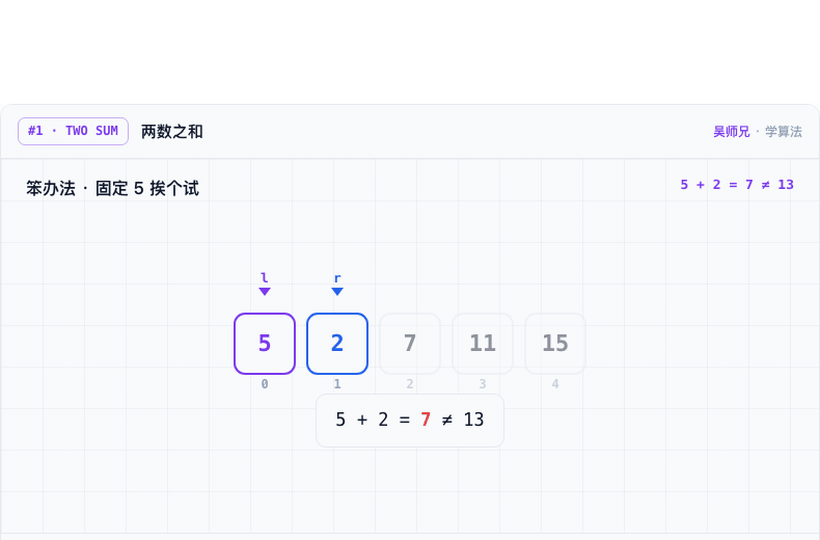
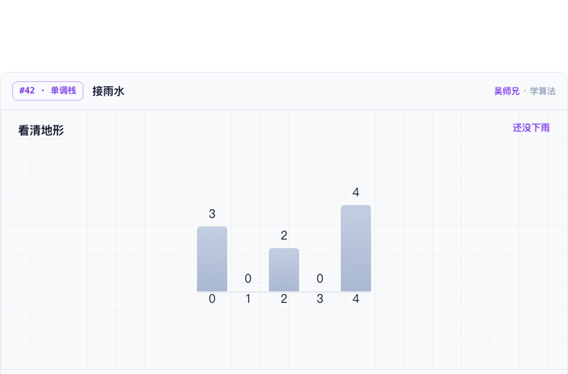
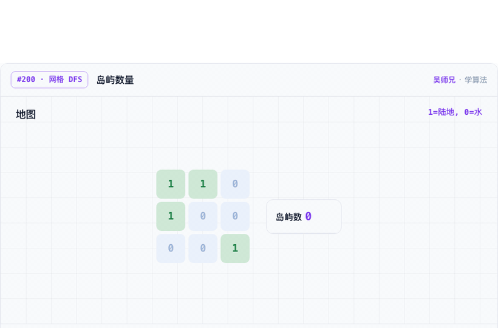
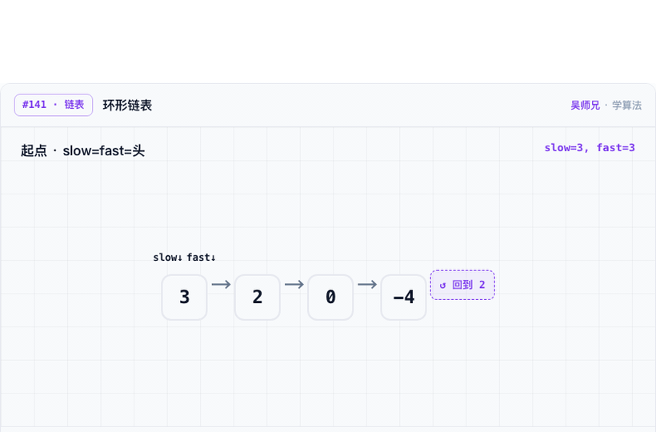

# LeetCodeAnimation

> 用动画把 LeetCode 题解过程拆开看：指针怎么移动、状态怎么转移、递归怎么展开、边界为什么成立。
> GitHub 这份是公开索引与历史素材；**完整的单步、回看、变速、语音讲解在网站版**。

<!-- 转化层：徽章组（人手维护）。题目数徽章读 docs/data/stats.json，数字由脚本接管，勿手改。 -->
[](https://github.com/MisterBooo/LeetCodeAnimation)
[](https://github.com/MisterBooo/LeetCodeAnimation/commits/master)
[](docs/leetcode-animation-index.md)

<!-- 三个转化主按钮：全部带 utm_source=github。链接清单见 docs/readme-revamp/utm-links.md -->
[](https://www.algomooc.com/leetcode-animation?utm_source=github&utm_medium=readme&utm_campaign=lca_revamp&utm_content=hero_interactive)
[](https://www.algomooc.com/topics?utm_source=github&utm_medium=readme&utm_campaign=lca_revamp&utm_content=hero_topics)
[](https://www.algomooc.com/ai-tutor?utm_source=github&utm_medium=readme&utm_campaign=lca_revamp&utm_content=hero_ai_xiaoou)

如果这个项目帮到你，欢迎 **Star** 支持持续更新。

---

## 🚧 2026 大版本进行中

这个仓库不是一次性归档。2026 年正在做一轮大版本升级，**只列已上线 / 进行中的实话**：

- ✅ **三语言参考代码**：每道题的题解配 **Python / C++ / Java** 三种实现，Python 为默认。
- ✅ **AI 私教「小欧」**：吴师兄带的 AI 算法私教，做题卡住可随时追问思路与边界。
- ✅ **吴师兄声线语音讲解**：动画边演示边讲，语音为 **AI 合成（吴师兄声线授权）**；点播放器里的 🔊 即可听。
- 🚧 **299 题全量质量清算**：对全站动画题逐题做质量复核与重制，分批上线，持续同步回本仓库索引。

> 进度会随同步脚本更新到下方「当前索引」与 [`docs/sync-log.md`](docs/sync-log.md)。

---

## 网站版动画预览

下面四张 GIF 取自网站播放器的关键帧，**点图直达对应题目页**（完整步骤播放、三语言代码、语音讲解都在网站版）。

<table>
  <tr>
    <td width="50%">
      <a href="https://www.algomooc.com/leetcode-animation/two-sum?utm_source=github&utm_medium=readme&utm_campaign=lca_revamp&utm_content=preview_two_sum">
        
      </a>
      <br>
      <strong>两数之和</strong>
      <br>
      边扫数组边维护哈希表，看清 complement 是怎么被找到的。
    </td>
    <td width="50%">
      <a href="https://www.algomooc.com/leetcode-animation/trapping-rain-water?utm_source=github&utm_medium=readme&utm_campaign=lca_revamp&utm_content=preview_trapping_rain_water">
        
      </a>
      <br>
      <strong>接雨水</strong>
      <br>
      用柱状图把左右边界和蓄水过程拆开，直观看懂为什么能接住水。
    </td>
  </tr>
  <tr>
    <td width="50%">
      <a href="https://www.algomooc.com/leetcode-animation/number-of-islands?utm_source=github&utm_medium=readme&utm_campaign=lca_revamp&utm_content=preview_number_of_islands">
        
      </a>
      <br>
      <strong>岛屿数量</strong>
      <br>
      DFS 染色过程一格一格展开，连通块边界会更容易看清。
    </td>
    <td width="50%">
      <a href="https://www.algomooc.com/leetcode-animation/linked-list-cycle?utm_source=github&utm_medium=readme&utm_campaign=lca_revamp&utm_content=preview_linked_list_cycle">
        
      </a>
      <br>
      <strong>环形链表</strong>
      <br>
      快慢指针在链表上同步移动，什么时候相遇一眼能看到。
    </td>
  </tr>
</table>

**↑ 网站版还能单步、回看、变速、听讲解** —— [打开在线交互版 →](https://www.algomooc.com/leetcode-animation?utm_source=github&utm_medium=readme&utm_campaign=lca_revamp&utm_content=preview_cta)

---

## 项目特点

- **动画题解**：先看清算法过程，再回到代码。很多题目保留了 GIF 或分步动画素材。
- **三语言代码**：题解配 Python / C++ / Java 三种参考实现。
- **结构化数据**：[`docs/data/manifest.json`](docs/data/manifest.json) 可被脚本读取，用于生成索引、检查链接或二次整理。
- **持续同步**：网站侧新增或调整动画后，通过脚本同步回 GitHub —— 仓库不是静态归档。

<!-- LCA-AUTOGEN:STATS START — 勿手改，数字由 tools/scripts/build-readme.js 注入 -->
## 当前索引

> 下表数字由 `tools/scripts/build-readme.js` 据 `docs/data/manifest.json` 实算注入，**请勿手改**。

| 项目 | 数量 / 位置 |
| :-- | :-- |
| LeetCode 动画题数 | **256** |
| 简单 | 71 |
| 中等 | 160 |
| 困难 | 25 |
| 数据文件 | [`docs/data/manifest.json`](docs/data/manifest.json) |
| 按题号索引 | [`docs/leetcode-animation-index.md`](docs/leetcode-animation-index.md) |
| 按专题索引 | [`docs/index-by-topic.md`](docs/index-by-topic.md) |
| 网站路径 | <https://www.algomooc.com/leetcode-animation> |

<!-- LCA-AUTOGEN:STATS END -->

> **数字口径**：上表 **256** 指**已同步到本仓库的 LeetCode 题动画数**（脚本据网站侧 `study_index.js` → `manifest.json` 实算）。
> 近况区提到的 **299** 指 **algomooc.com 全站动画内容总数**（含进阶题与专题，口径来自站内 `content-stats` 单一数据源），范围比本仓库已同步的 LeetCode 子集更大。
> 两个数字都**由脚本接管、禁止手写**：256 来自本仓库 manifest，299 随站内 content-stats 同步回填（见 [`docs/data/stats.json`](docs/data/stats.json) 的 `siteTotal` 字段）。

---

## 内容地图

| 想找什么 | 从这里开始 |
| :-- | :-- |
| 按题号查动画 | [`docs/leetcode-animation-index.md`](docs/leetcode-animation-index.md) |
| 按专题查动画 | [`docs/index-by-topic.md`](docs/index-by-topic.md) |
| 用脚本处理题目数据 | [`docs/data/manifest.json`](docs/data/manifest.json) |
| 查看早期题解文章 | [`docs/notes/`](docs/notes) 或 [`problems/`](problems) 下各题的 `Article/` |
| 查看早期动画素材 | [`problems/`](problems) 下各题的 `Animation/` |
| 查看同步记录 | [`docs/sync-log.md`](docs/sync-log.md) |

---

<details>
<summary><strong>🛠 维护者：同步与数据说明</strong>（点击展开 —— 普通读者可略过）</summary>

### 仓库和网站的关系

GitHub 仓库保存历史内容、公开索引和同步脚本；网站侧维护当前动画页面。交互播放、步骤切换、阅读体验以网站版本为准。同步脚本把网站题目列表写回仓库，方便在 GitHub 上审阅、检索和版本化。

### 同步方式

网站侧题目索引来自 `study_index.js`。同步前先审查：

```bash
npm run review:site
```

确认需要同步后运行：

```bash
npm run sync        # 更新 manifest / 题号索引 / 专题索引 / 同步记录
npm run validate    # 校验 manifest
node tools/scripts/build-readme.js --write   # 把 README 数字段 + stats.json 重新注入
```

会更新：

- `docs/data/manifest.json`
- `docs/leetcode-animation-index.md`
- `docs/index-by-topic.md`
- `docs/sync-log.md`
- `docs/data/stats.json` 与 README 的 `当前索引` 标记区（数字段）

更完整的判断规则、commit 规范和数字接管机制见 [`docs/sync-workflow.md`](docs/sync-workflow.md) 与 [`docs/HOW-TO-INTERACT.md`](HOW-TO-INTERACT.md)。

### 目录

| 路径 | 说明 |
| :-- | :-- |
| `docs/data/manifest.json` | LeetCode 动画索引数据（数字单一数据源） |
| `docs/data/stats.json` | 由脚本实算的计数，供 README 徽章读取 |
| `docs/leetcode-animation-index.md` | 由 manifest 生成的题目列表 |
| `docs/index-by-topic.md` | 由 manifest 生成的专题索引 |
| `docs/sync-log.md` | 网站侧索引同步记录 |
| `docs/sync-workflow.md` | 网站和 GitHub 联动流程 |
| `tools/scripts/review-site-changes.js` | 判断网站侧改动是否需要同步 |
| `tools/scripts/sync-algomooc-index.js` | 从网站侧 `study_index.js` 同步索引 |
| `tools/scripts/validate-manifest.js` | 校验 manifest |
| `tools/scripts/build-readme.js` | 注入 README 数字段 + 生成 `stats.json` |
| `docs/assets/previews/` | README 使用的网站版动画预览 GIF |
| `docs/notes/` · `problems/` | 早期题解文章、代码与动画素材 |

</details>

---

## ⭐ Star 一下，见证 299 役收官

[](https://star-history.com/#MisterBooo/LeetCodeAnimation&Date)

这个项目从一张张手画动画走到今天，靠的是每一个 Star 的鼓励。
如果它让你把某道题真正看懂了，**点个 Star** 就是对持续更新最实在的支持。

> 📌 内容持续同步自 **[algomooc.com](https://www.algomooc.com/leetcode-animation?utm_source=github&utm_medium=readme&utm_campaign=lca_revamp&utm_content=footer_site)** —— 网站更新，仓库索引随脚本同步。

## English

See [`docs/README-En.md`](docs/README-En.md).
